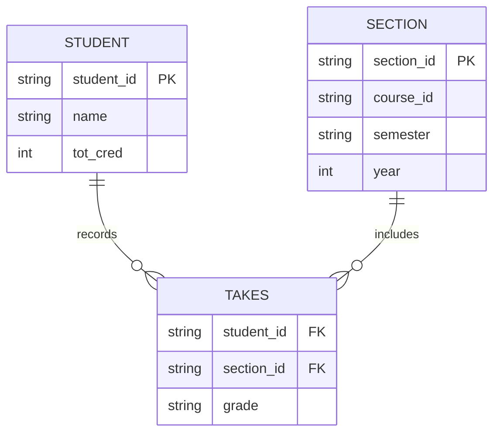

# Descriptive Attribute

## Definition

A [[Descriptive Attribute]] is an [[Attribute]] of a [[Relationship]]. [^1]

## Representation

Visually, a [[Descriptive Attribute]] can be represented as its own square, but connected to the [[Relationship Instance]] via a dotted line.

![[Descriptive Attribute.png]]

Using a standard [[Entity-Relationship Data Model|Entity-Relationship Model]] diagram, it's represented as another [[Entity]]

## References

[^1]: Database System Concepts, p. 246
[^2]: Database System Concepts, p. 248
