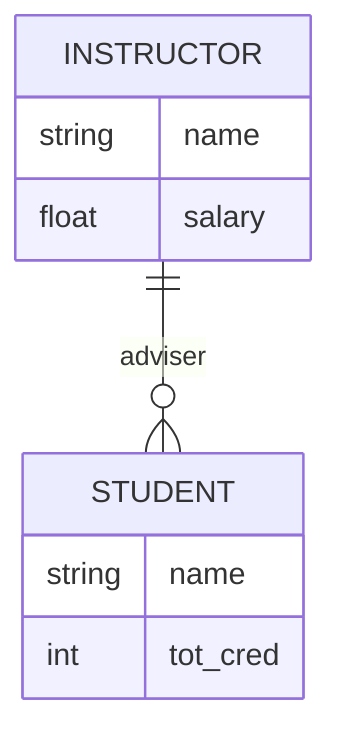

---
aliases:
  - Relationship Instances
tags:
  - database
date created: Monday, August 31st 2026, 9:50:44 pm
date modified: Monday, August 31st 2026, 10:21:29 pm
---
Z
# Relationship Instance

## Definition

A [[Relationship Instance]] in an [[Entity-Relationship Data Model|Entity-Relationship Model]] [[Schema]] represents an association between named [[Entity|Entities]] in a system being modeled [^1]

## Representation

Visually, a [[Relationship Instance]] can be represented using a diamond, linking [[Entity Set|Entity Sets]]. [^1] See the following image for an example:

![[Relationship Instance.png]]

Alternatively, the [[Relationship Instance]] can be represented using the following wherein the expected count is already illustrated.

## References

[1]: Database System Concepts, pp. 245 - 247
