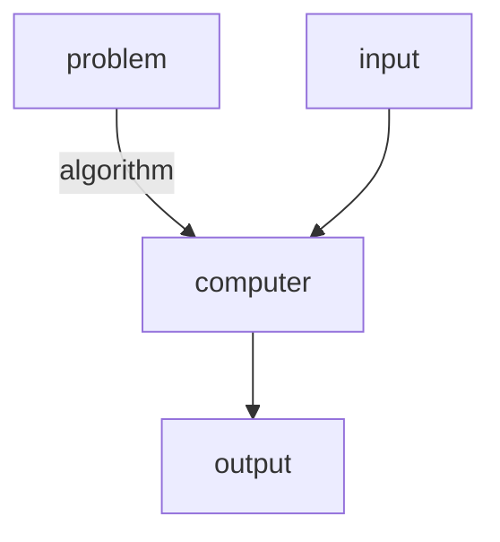

# Algorithm

> [!quote] Donald Knuth, Computer Scientist
> It has often been said that a person does not really understand something until after teaching it to someone else. Actually, a person does not really understand something until after teaching it to a computer, i.e., expressing it as an algorithm. An attempt to formalize things as algorithms leads to a much deeper understanding than if we simply try to comprehend things in the traditional way.

## Definition

An [[Algorithm]] is a sequence of unambiguous instructions or [[Function|Functions]] for solving a problem (as specified in the [[Problem Domain]] [^1]

## Properties

An [[Algorithm]] has five important properties to consider [^1]

- **Input:** An [[Algorithm]] takes [[Domain|Inputs]]
- **Output:** An [[Algorithm]] produces [[Codomain|Outputs]]
- **Finiteness:** An [[Algorithm]] must terminate after a finite number of steps.
- **Definiteness:** An [[Algorithm]]'s steps are precisely defined
- **Effectiveness:** All operations performed must be sufficiently basic that they can be done exactly and in finite time by a person, at least in principle.

## References

[1]: Introduction to the Design and Analysis of Algorithms, p. 3

[^1]: Data Structures, p. 5
