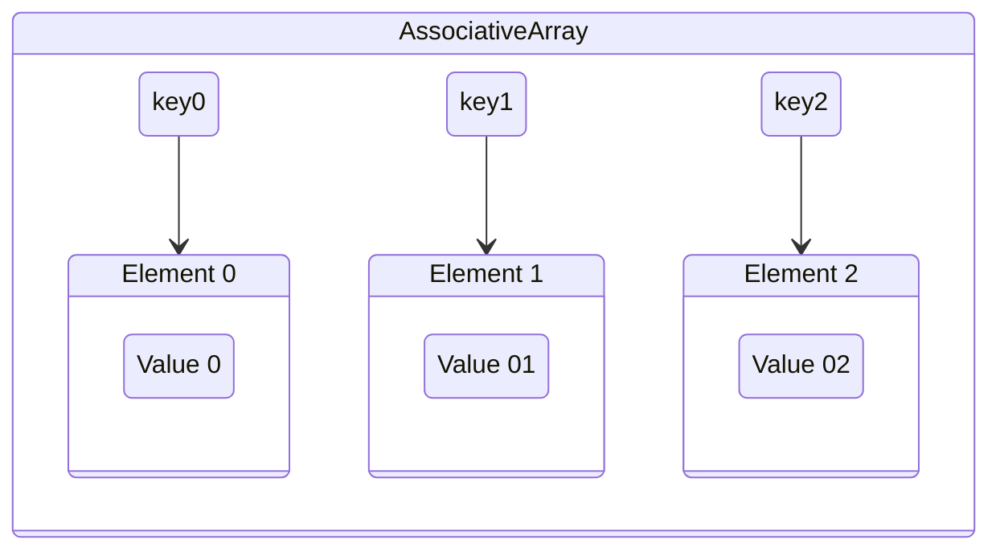

---
aliases:
  - Associative Arrays
  - Key
  - Keys
  - Value
  - Values
tags:
  - data-type
date created: Wednesday, September 30th 2026, 11:11:22 pm
date modified: Wednesday, September 30th 2026, 11:13:34 pm
---

# Associative Array

## Definition

An [[Associative Array]] is an unordered collection of data elements that are [[Pointer|Indexed]] by an equal number of values called keys. [^1]

## Reference

[1]: Concepts in Programming Languages, Ch. 6
