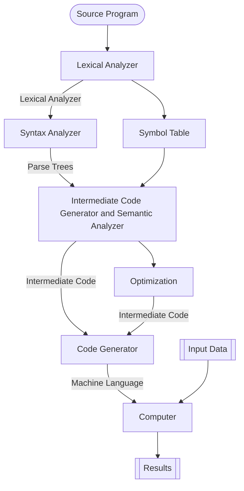

# Compilation

## Definition

[[Compilation]] is a method wherein [[Program|Programs]] can be translated into machine language that can be executed directly on the computer. [^1]

## Process

The process is defined as the following:

## Reference

[1]: Concepts of Programming Languages, Ch. 1, p. 47
