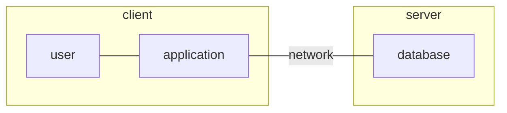
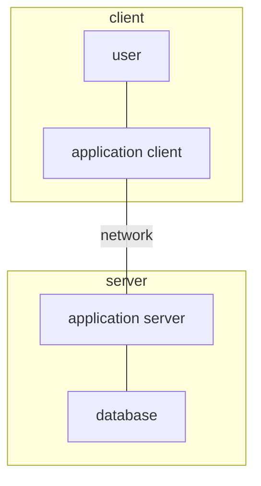

# Database Application

## Definition

A [[Database Application]] is an application that uses [[Database|Databases]] as their back-end. [^1]

## Architecture

A [[Database Application]] can be partitioned into two or three parts. [^1]

### Two-Tier Architecture

Used by earlier generation [[Database Application|Database Applications]] where the applications reside at the client machine and invokes [[Database-Management System]] functionalities at the server machine through [[Query Language]] statements. [^1]

### Three-Tier Architecture

Use by modern [[Database Application|Database Applications]] where the client machine acts as a front end and doesn't contain any direct [[Query|Queries]]. Examples of this include web browsers and mobile applications. The front end communicates with an application server. This server then communicates with a [[Database-Management System]] to access data. The application server contains the business logic for better security and performance. [^1]

## Reference

[1]: Database System Concepts, p. 23
