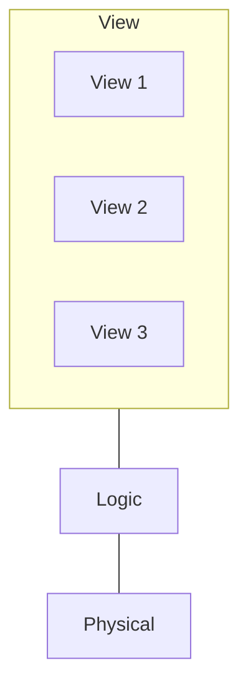

# Database-Management System

## Definition

A [[Database-Management System]] is a collection of interrelated data and a set of [[Program|Programs]] to access those data. [^1]

## Purpose

A [[Database-Management System]] offers solutions to the following problems: [^2]

1. Data redundancy and inconsistency
2. Difficulty in accessing data
3. Data isolation
4. Integrity problems
5. Atomicity Problems
6. Concurrent-access Anomalies
7. Security Problem

## Abstractions

To simplify user interaction, [[Database-Management System|Database-Management Systems]] offer data abstractions in three levels: [^3]

### Physical Level

The lowest level of abstraction that describes *how* the data is actually stored in a physical system. [^3]

### Logic Level

The next-higher level of abstraction that describes *what* data are stored in the [[Database]] and what relationships exists among those data. This deals with [[Data Type|Data Types]] and [[Data Structure|Data Structures]][^3]

### View Level

The highest level of abstraction only part of the entire [[Database]]. This is the domain of application developers. [^3]

## History

Here are the summarized notes for the history of [[Database-Management System]], as enumerated in [^4]

- **1950s and early 1960s:** Data was stored on **magnetic tapes and punched cards**, forcing strict sequential processing and manual sorting (e.g., matching master tapes with transaction cards).
- **Late 1960s–Early 1970s:** The introduction of **hard disks** allowed direct, non-sequential data access. This era saw the rise of network and hierarchical data models, followed by Edgar Codd's landmark 1970 paper introducing the **relational model**.
- **Late 1970s–1980s:** Breakthrough projects like IBM's System R proved relational databases could match older models in performance. By the 1980s, relational databases (e.g., DB2, Oracle) became dominant due to their ease of use and automated query optimization, alongside early work in parallel and distributed databases.
- **1990s:** Decision-support systems and data analysis re-emerged alongside update-intensive transaction processing. The **World Wide Web** triggered a massive expansion in database deployment, requiring high reliability, 24/7 availability, and web interfaces.
- **2000s:** Data types rapidly diversified to include semi-structured formats (**XML and JSON**), spatial data, and graph data for social networks. This decade saw the rise of open-source databases (MySQL, PostgreSQL), column-stores for analytics, MapReduce frameworks, and **NoSQL** systems prioritizing flexibility and scalability over strict relational schemas.
- **2010s:** NoSQL systems evolved to incorporate better consistency features, while enterprises increasingly shifted toward **cloud computing** and Software as a Service (SaaS). This period also brought heightened focus on cybersecurity, data ownership, and government privacy regulations.

## References

[^1]: Database System Concepts, p. 1

[^2]: Database System Concepts, pp. 7-8

[^3]: Database System Concepts, pp. 9-10

[^4]: Database System Concepts, pp. 25-28
