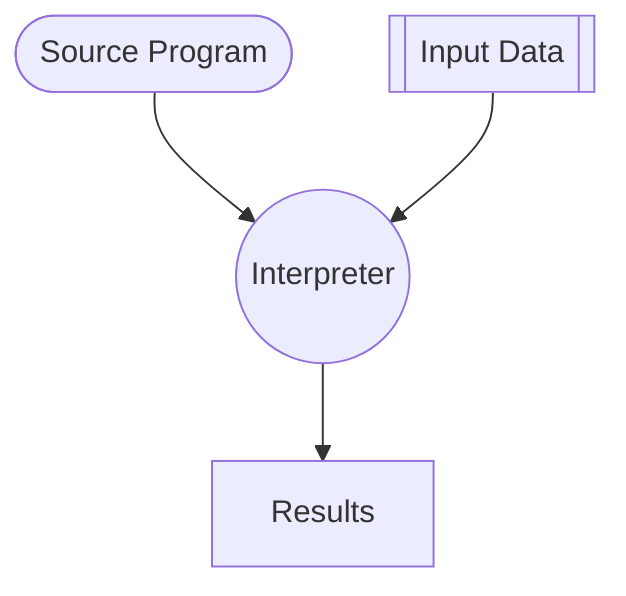

# Pure Interpretation

## Definition

[[Pure Interpretation]] interprets a [[Language|Programming Language]] using another [[Program]] called [[Pure Interpretation|Interpreter]], with no [[Compilation]]. [^1]

## Reference

[1]: Concepts of Programming Languages, Ch. 1, p. 50
