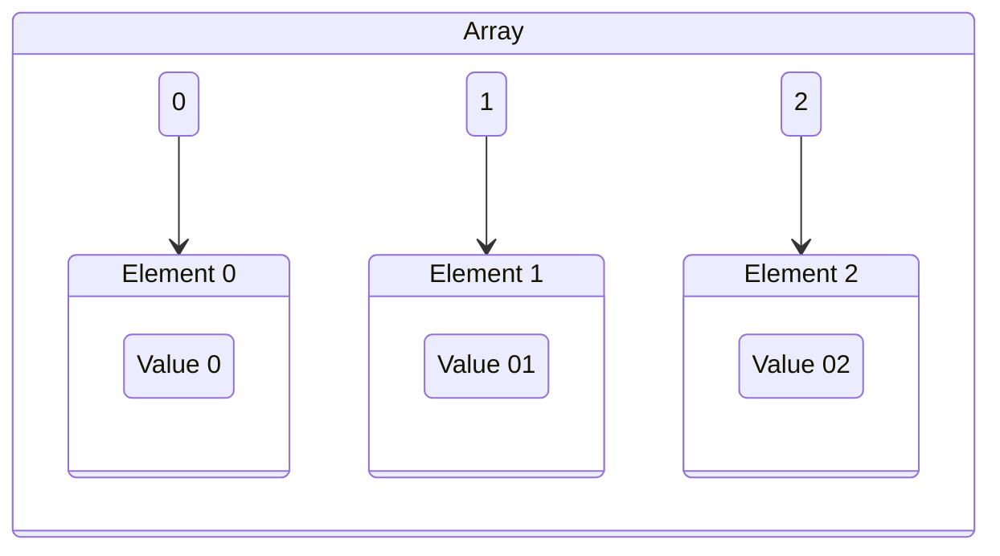

# Array

## Definition

The [[Array]] is a fixed-size, [[Contiguous Data Structure]] of [[Set Membership|Elements]] with the same type, defined as a [[Finite Sequence]] of [[Record|Records]] wherein the [[Record|Keys]] are sequential [[Pointer|Indices]], represented using the [[Whole Number|Set of Whole Numbers]] $\mathbb{W}$ [1]

If the first [[Set Membership|Element]] of an [[Array]] starts at memory address $a$, and each [[Set Membership|Element]] takes $b$ bytes, then the $i-th$ [[Set Membership|Element]] occupies bytes $a + bi$ to $a + bi + b - 1$ [^2]

## Record Access

Given the corresponding [[Pointer|Index]] of a [[Record]], direct access can be done in [[Asymptotic Upper Bound|Worst-Case]] constant running time $O(1)$ [^1]

## References

[1]: The Algorithm Design Manual, p. 70
[2]: Introduction to Algorithms, p. 252
