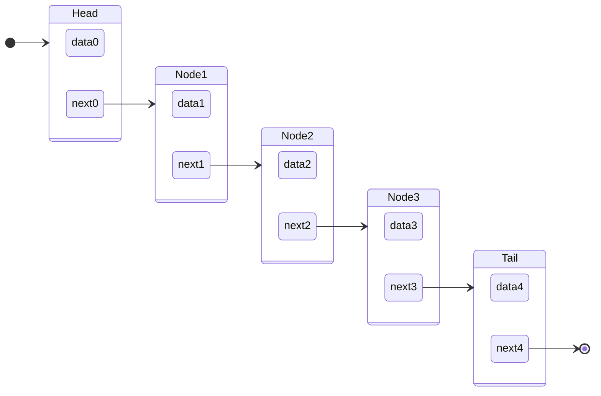
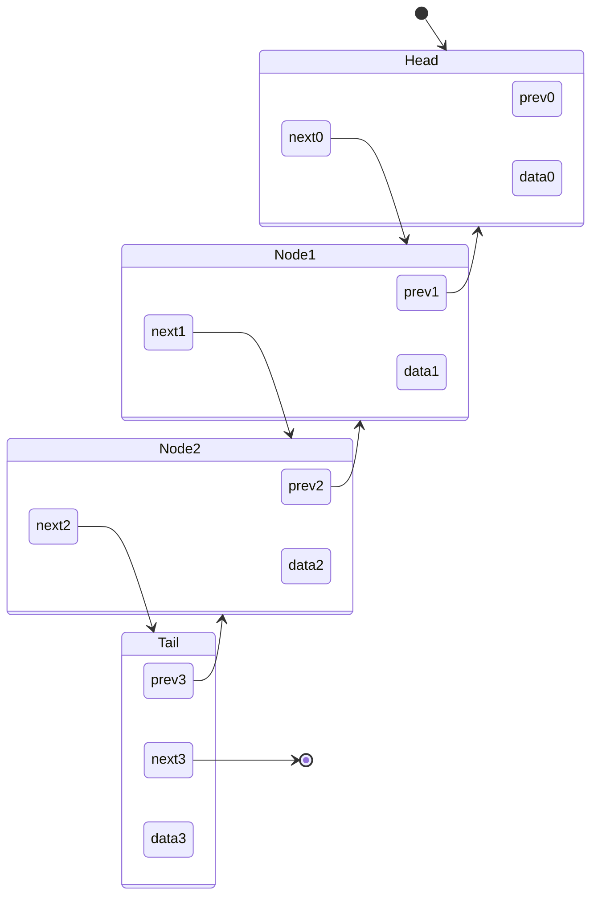

# Linked List

## Definition

A [[Linked List]] is a [[Linked Data Structure]] that has a starting [[Node]], called a [[Linked List|Head]], and a final [[Node]] node called [[Linked List|Tail]][^1]

### Singly Linked Definition

A [[Linked List|Singly Linked List]] has nodes that can only have a single [[concepts/Pointer]], often called the [[Linked List|Next Pointer]], to another, distinct node that has not been pointed to in the [[Linked List]] so far. The [[Linked List|Tail]] has a [[concepts/Pointer|Null Pointer]] as its [[Linked List|Next Pointer]] [^1]

### Doubly Linked Definition

A [[Linked List|Doubly Linked List]] has nodes that can have two [[concepts/Pointer|Pointers]], a [[Linked List|Next Pointer]], which is still restricted to pointer to another distinct node, and a [[Linked List|Previous Pointer]], which points to the node that has the current node in its [[Linked List|Next Pointer]] [^1] In this case, the [[Linked List|Head]]'s [[Linked List|Previous Pointer]] is a [[concepts/Pointer|Null Pointer]] by definition.

## References

[1]: The Algorithm Design Manual, p. 72
