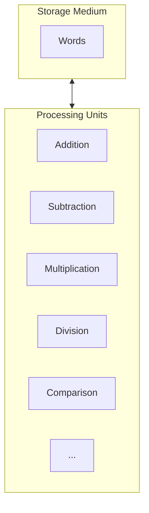

# Machine Domain

The [[Machine Domain]] is the domain of the problem-solving process that describes a storage medium consisting of serially arranged bits that are organized into [[Address Space|Address Spaces]], and [[Central Processing Unit|Processors]] that allow basic operations [^1]

## Reference

[1]: Data Structures, p. 2
