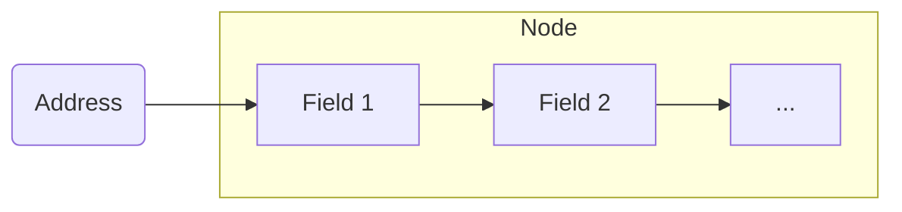

# Node

A [[Node]] is an accessible [[Memory Address]] pointing to named segments called _fields_. [^1]

Given a [[concepts/Pointer]] $\alpha$ pointing to information $x$, with a link to a [[concepts/Pointer|Null Pointer]] $\Lambda$, the following [[Node]] can be written with the following notation:

$$
	\alpha: 
	\begin{array}{|c|c|}
	  \hline
	      \text{INFO} & \text{LINK} \\
	  \hline
	      x & \Lambda \\
		\hline
	\end{array}
$$

$$
	INFO(\alpha) \gets x
$$
$$
		LINK(\alpha) \gets \Lambda
$$

## References

[1]: Data Structures, p. 9
