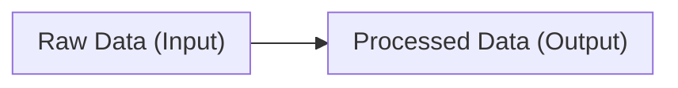

# Problem Domain

The [[Problem Domain]] is the domain of the problem-solving process that describes the raw data or [[Domain|Inputs]] and the expected Processed data or [[Codomain|Outputs]]. [^1]

## Reference

[1]: Data Structures, p. 2
