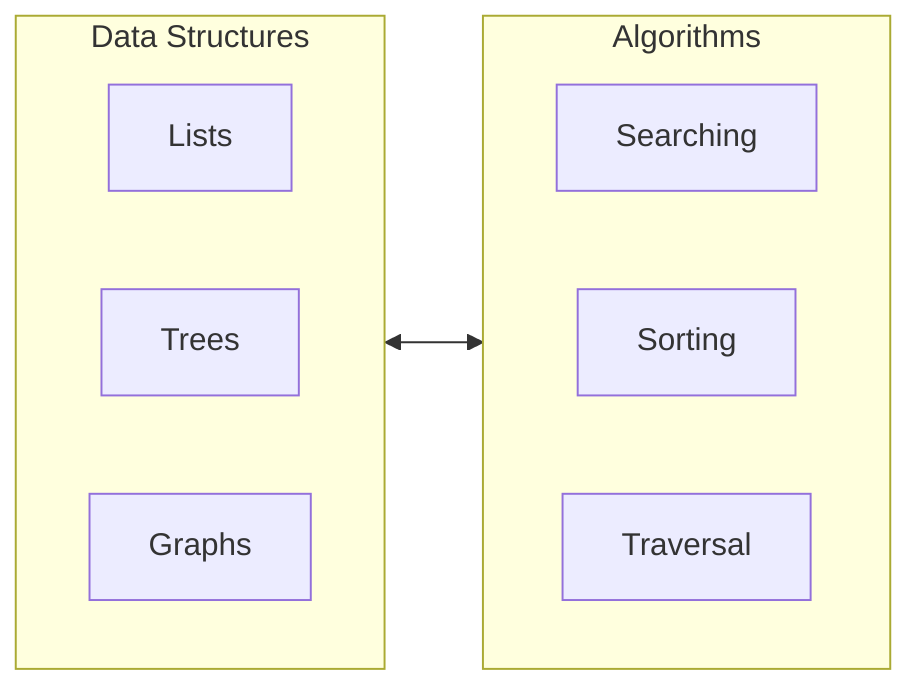

# Solution Domain

The [[Solution Domain]] is the domain of the problem-solving process that links the [[Problem Domain]] with the [[Machine Domain]]. It consists of two components: [^1]
- [[Data Structure|Data Structures]] to represent higher level data representations into the level understandable for the [[Machine Domain]]
- [[Algorithm|Algorithms]] built from the basic operations of the [[Machine Domain]] to manipulate the [[Domain|Inputs]] of the [[Problem Domain]] into the expected [[Codomain|Outputs]]

## Reference

[1]: Data Structures, p. 2
