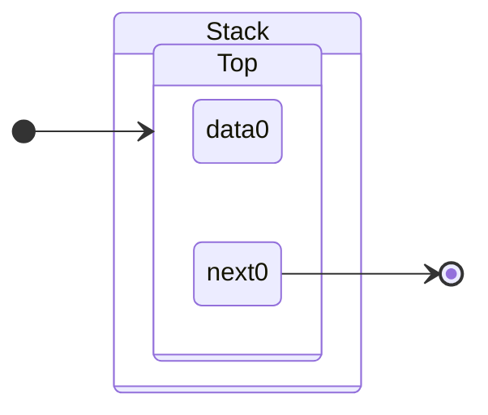
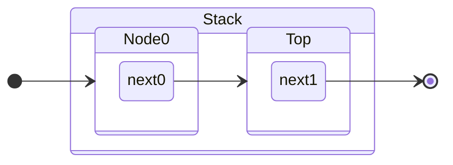
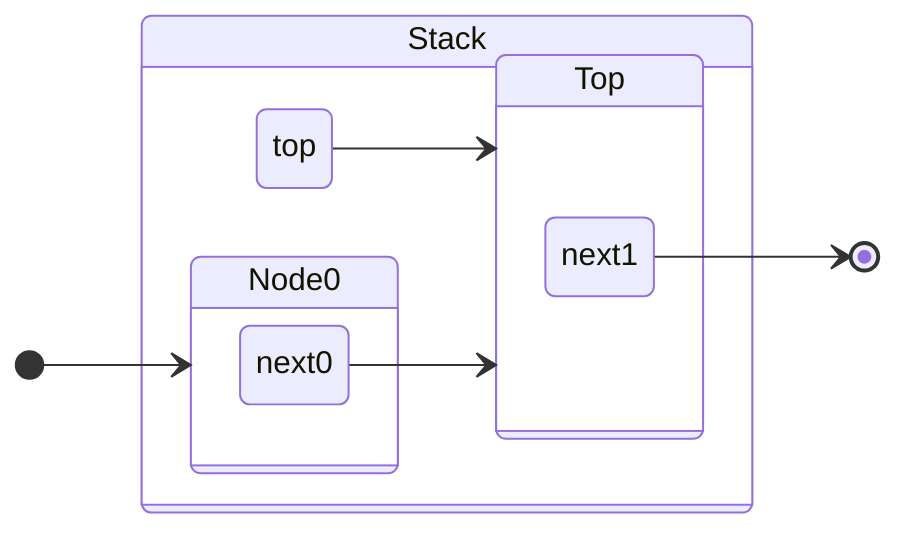
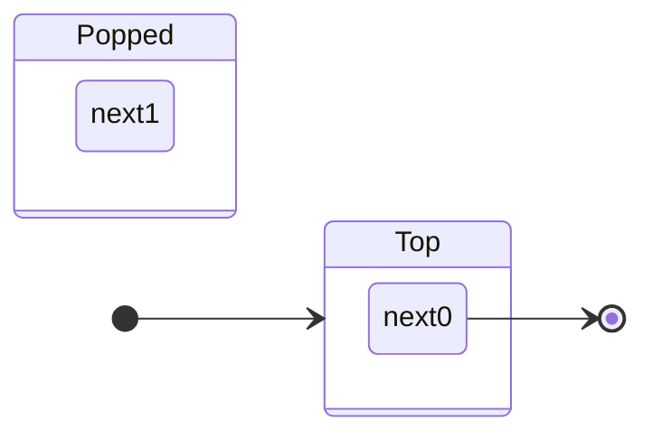
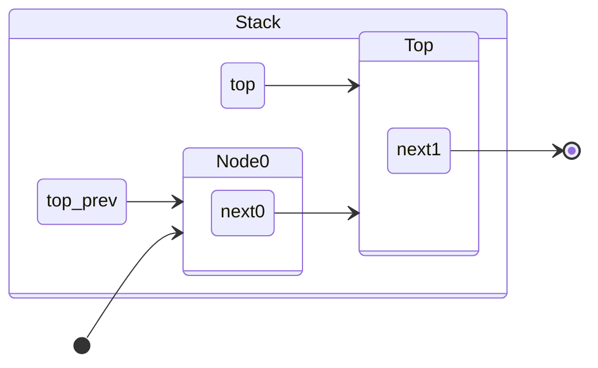
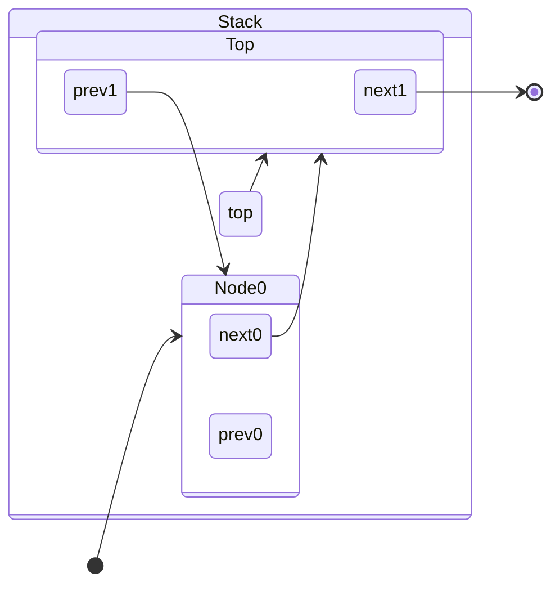
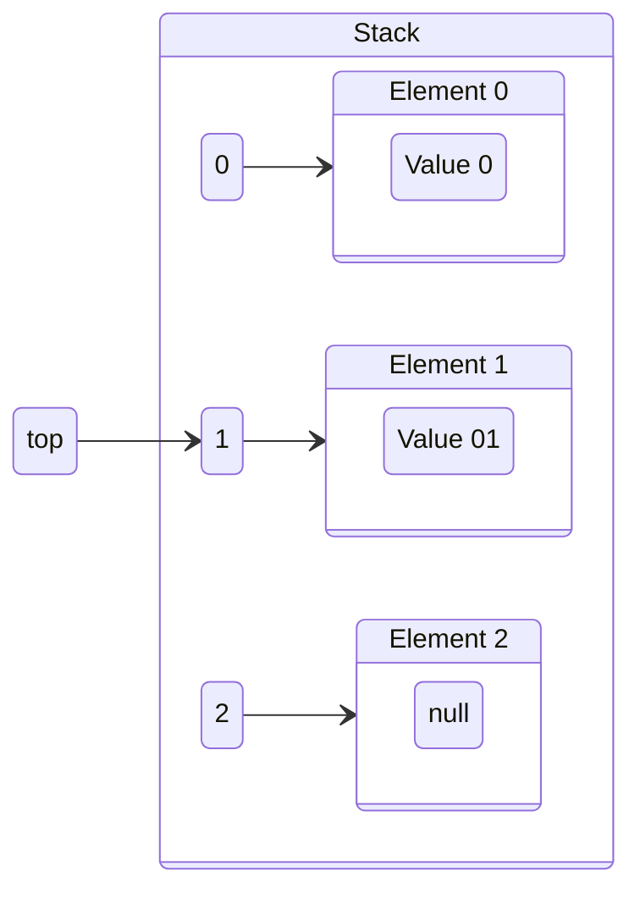

# Stack

## Dynamic Definition

A [[Stack]] is a [[Linked List|Singly Linked List]] that follows the [[Stack|Last-In First-Out]] retrieval order for its [[Record|Records]] by supporting the [[Push Operation]] to insert [[Record|Records]] at the end or top of the [[Stack]], and the [[Pop Operation]] to remove [[Record|Records]] at the end or top of the [[Stack]] [^1]

## Demonstration

Consider an initial [[Stack]] with a single node as shown. By definition, this node is the top of the [[Stack]] since its next component has a [[concepts/Pointer|Null Pointer]]. For further visualizations, the data component is omitted for brevity.

### Push Operation

Performing a [[Push Operation]] transfers the memory address in the top node's [[concepts/Pointer]] to the new node's memory address, thereby making it the new top of the [[Stack]].

Accessing the top node in this case would have a [[Asymptotic Upper Bound|Worst-Case]] linear running time $O(n)$ since looking for the node with an [[concepts/Pointer|Empty Pointer]] for its next case requires checking every node. However, a [[concepts/Pointer]] can be kept on the current top node. With this, changing the current top node's [[concepts/Pointer]] to the new node will have a [[Asymptotic Upper Bound|Worst-Case]] constant running time $O(1)$.

> [!info]
> Make sure to update the [[concepts/Pointer]] to the top node for [[Push Operation|Push]] and [[Pop Operation|Pop Operations]]

### Pop Operation

Performing a [[Pop Operation]] changes the memory address of the [[concepts/Pointer]] of the node preceding the top node to a [[concepts/Pointer|Null Pointer]]. By definition, this makes the preceding node into the current top node. A variation of the [[Pop Operation]] also returns the memory address of the removed node.

> [!warning]
> Make sure to keep a reference to the popped node to properly deallocate it

Similar to the [[#Push Operation]], having constant time access $O(1)$ for a specific node removes the need for iteration that takes linear running time $O(n)$. In this case, a [[concepts/Pointer]] to the [[Predecessor Operation|Predecessor]] of the current top node can facilitate this.

Alternatively, a [[Linked List|Doubly Linked List]] can be used to implement the [[Stack]] for constant [[Asymptotic Upper Bound|Worst-Case]] $O(1)$ running time access to any node's predecessor without using an iterative [[Predecessor Operation]].

## Static Definition

If a [[Stack]] has an upper limit on its [[Record|Records]], then an [[Array]] can also be used to implement a [[Stack]] by keeping the [[concepts/Pointer|Index]] of the top [[Record]].

## References

[1]: The Algorithm Design Manual, p. 75
