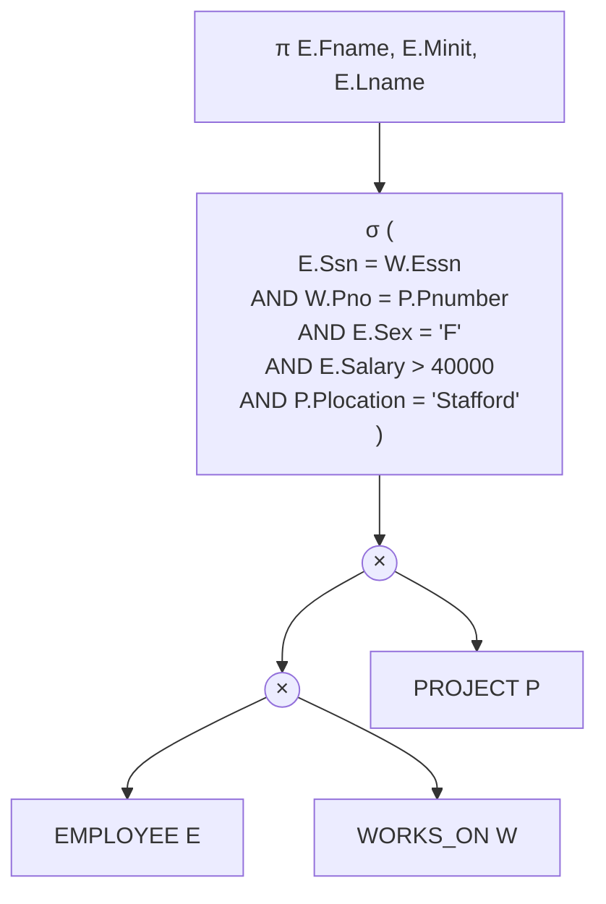
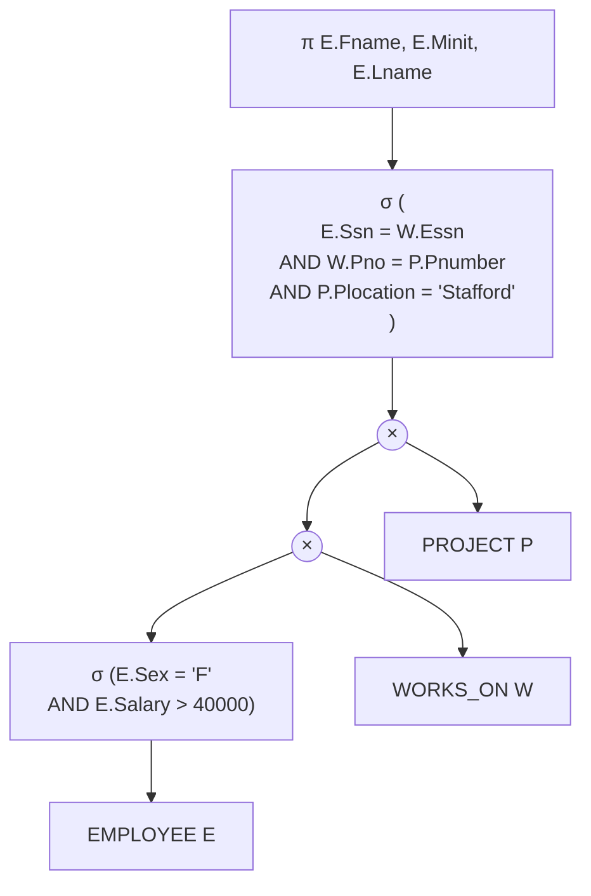
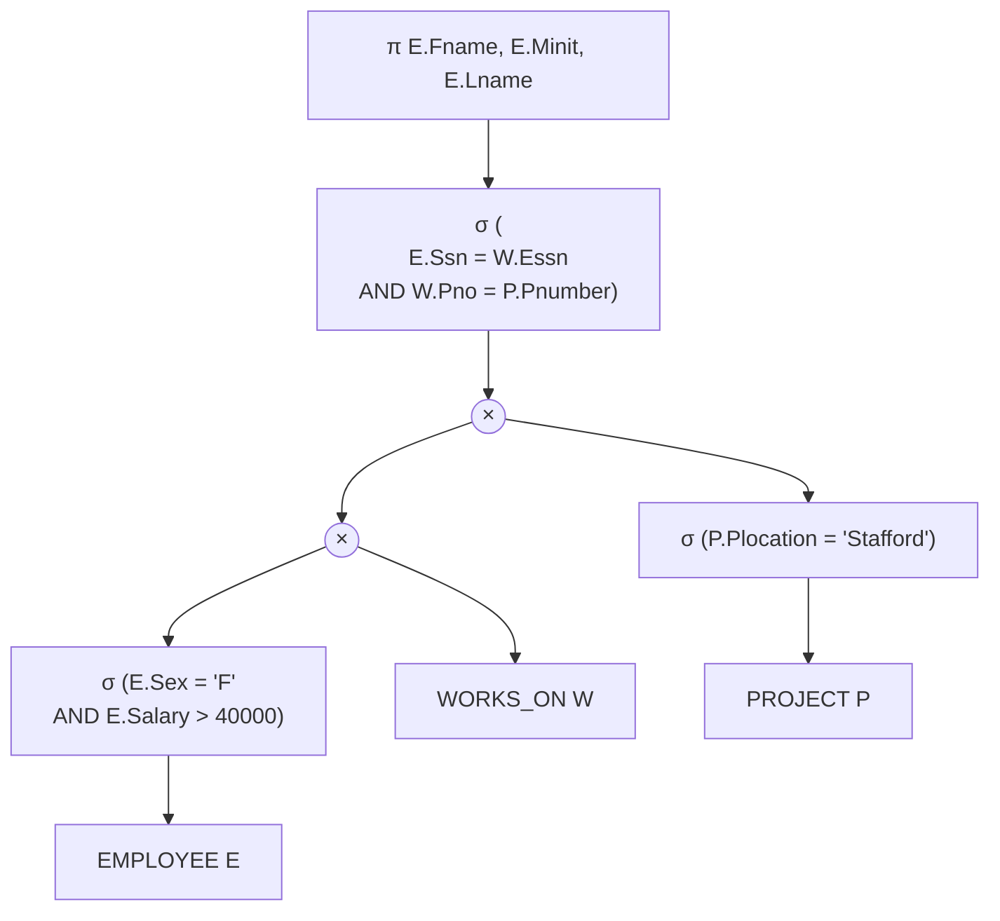
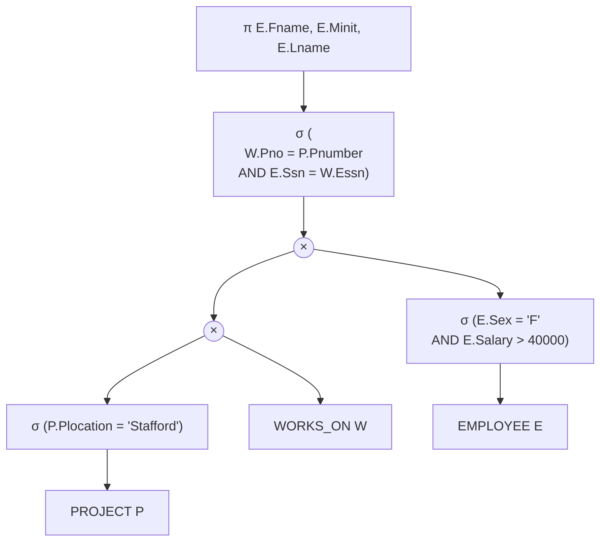
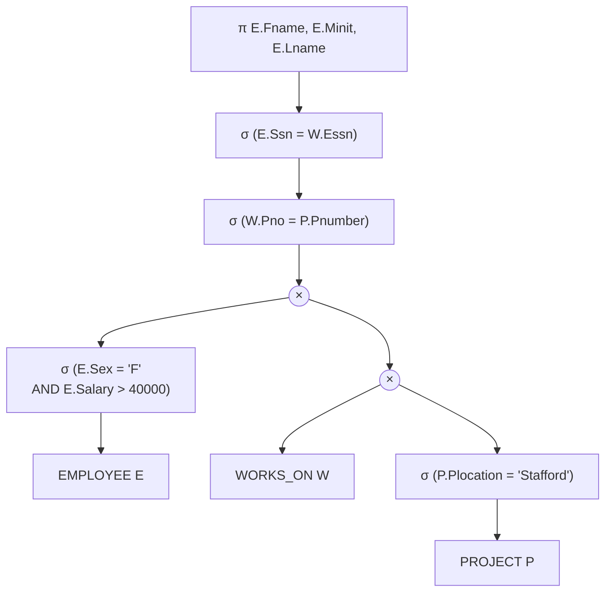
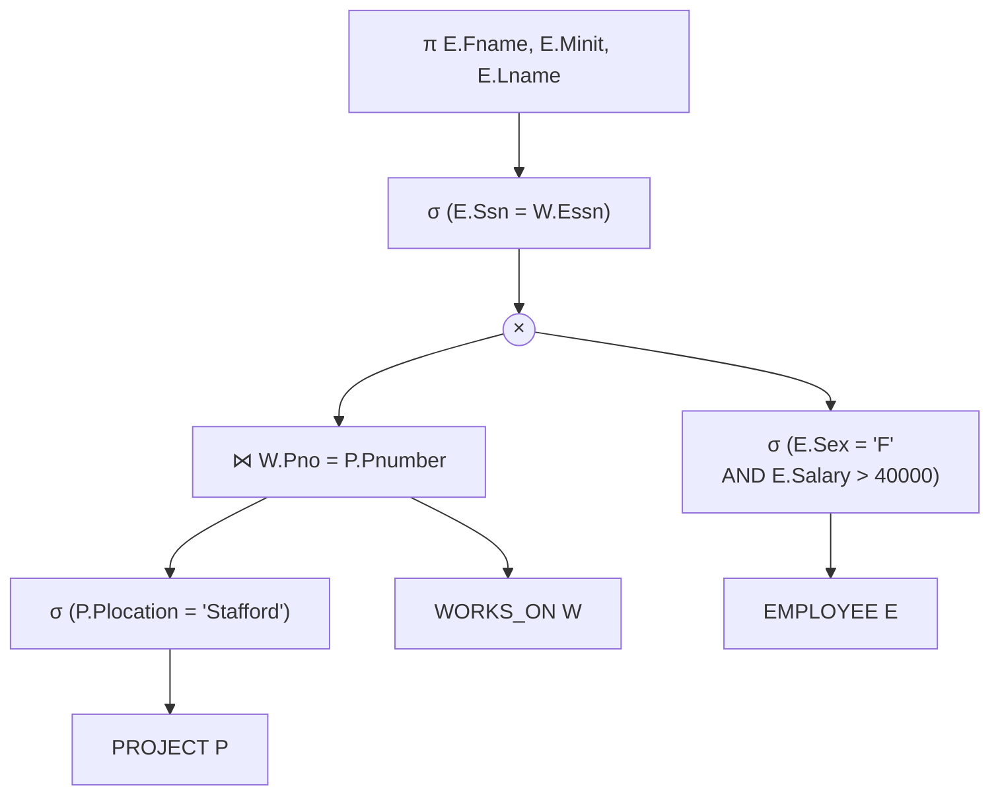
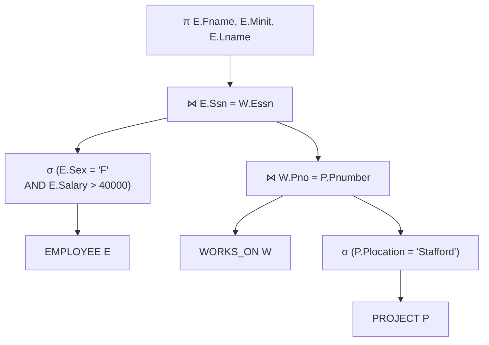
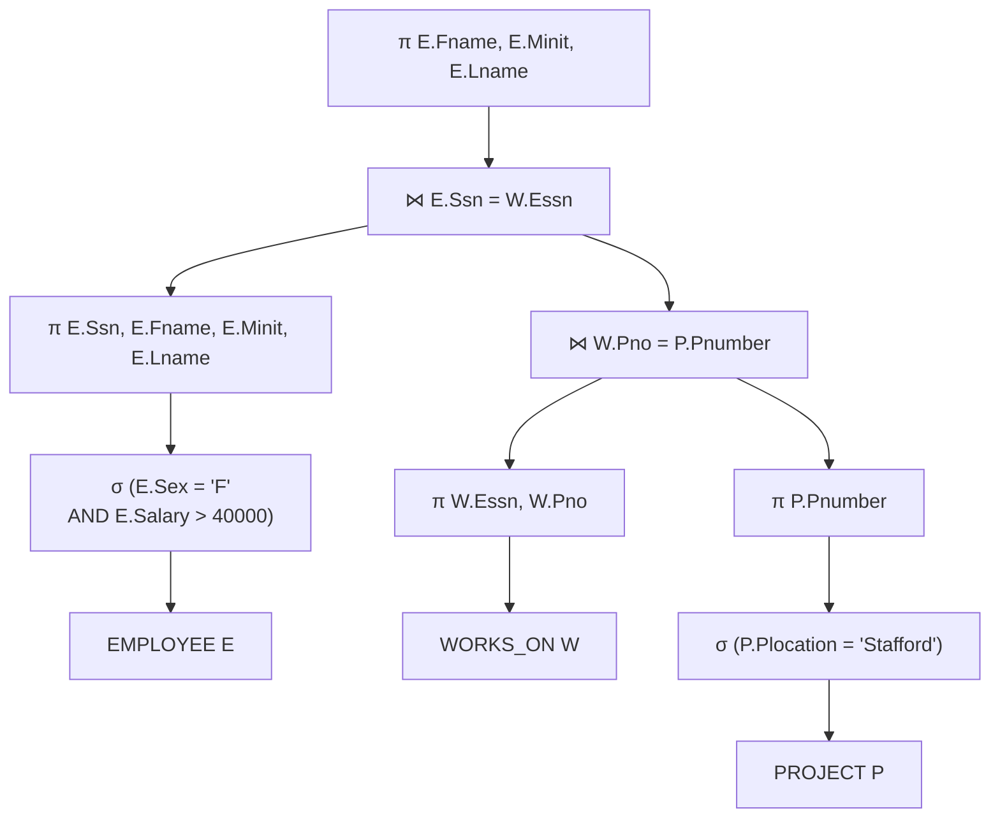

# CS 197 FZZQ - Assessment 07

Submitted by Stephen Sabas Singer on September 21, 2026

## Logical Schema

Here is the provided logical schema for the assessment:
- Employee(Fname, Minit, Lname, <u>Ssn</u>, Bdate, Address, Sex, Salary, Super_ssn, Dno)
- Department(Dname, <u>Dnumber</u>, Mgr_ssn, Mgr_start_date)
- Dept_Locations(<u>Dnumber</u>, <u>Dlocation</u>)
- Works_on(<u>Essn</u>, <u>Pno</u>, Hours)
- Project(Pname, <u>Pnumber</u>, Plocation, Dnum)
- Dependent(<u>Essn</u>, <u>Dependent_name</u>, Sex, Bdate, Relationship)

## Request

### Instruction

The main query of the assessment is written as the following instruction:

> [!Example] Instructions
> Retrieve the names of all female employees who are working on projects located in Stafford and have a salary greater than 40,000

This request can be rewritten as the following SQL query:

```SQL
SELECT 
	E.Fname,
	E.Minit
	E.Lname,
FROM 
	EMPLOYEE E, 
	WORKS_ON W, 
	PROJECT P
WHERE 
	E.Ssn = W.Essn
  AND W.Pno = P.Pnumber
  AND E.Sex = 'F'
  AND E.Salary > 40000
  AND P.Plocation = 'Stafford';
```

### Query Tree

With the given query, the following is the initial, unoptimized query tree.



## Heuristic Optimization

As hinted, the query tree can be further simplified using heuristic optimization techniques.

### Select Optimization

The first step is to optimize $EMPLOYEE$ by moving the Employee-specific selections $\sigma$ downward.



The second step is to optimize $PROJECT$ by moving the Project-specific selections $\sigma$ downward.



The next step is to apply the more restrictive select operation first.

Despite the use of an AND operation on the $EMPLOYEE$, it is likely that there will still be multiple rows for the resulting relation.

Compare this with $PROJECT$ that is likely to have fewer entries than $EMPLOYEE$ from the start, and will be further reduced by the location selection.

Thus, doing a cartesian product with $PROJECT$ and $WORKS\_ON$ first will yield less entries than the current $EMPLOYEE$ and $WORKS\_ON$ cross product.



### Using Join Operations

The next step is to replace the sequence of using a cartesian product $\times$ and selection $\sigma$ with the use of a join operation $\bowtie$.

The prerequisite step is to further split the first selection into two to maximize this heuristic optimization step.



Then, it's more obvious that the selection $\sigma_{W.Pno = P.Pnumber}$ can be merged with the cross product $\times$ below to make the equivalent join operation $\bowtie_{W.Pno = P.Pnumber}$.



Then, the selection $\sigma_{E.Ssn = W.Essn}$ can also be merged with the cross product $\times$ below to make the equivalent join operation $\bowtie_{E.Ssn = W.Essn}$.



### Projection Optimization

The final step is to apply projections prior to join operations to minimize the columns. There are three areas to improve for this step.
1. $PROJECT$ only needs $Pnumber$ after the location filter.
2. $WORKS\_ON$ only needs $Pno$
3. $EMPLOYEE$ only needs $Ssn$ for the join, and the $Fname, Minit, Lname$ for the actual request after the initial selection.

Adding the filters leads to the final, optimized query tree.



### Query Execution Plan

- The projections ($\pi_{\text{Ssn, Fname, Minit, Lname}}$, $\pi_{\text{Essn, Pno}}$, and $\pi_{\text{Pnumber}}$) filter out unnecessary attributes early, reducing the tuple width in memory before intermediate processing.
- The selections $\sigma_{\text{Plocation}}$ and $\sigma_{\text{Salary}}$ can use a secondary ($B^+$ tree) index given high selectivity and applicability for range queries.
- The selection $\sigma_{\text{Sex}}$ has low selectivity and operates on an unsorted attribute. Therefore, a linear search (full scan) is the primary option.
- The first join, $\text{PROJECT} \bowtie_{W.\text{Pno} = P.\text{Pnumber}} \text{WORKS\_ON}$, can be executed using a Single-Loop Join, driving with the outer loop on the small filtered $PROJECT$ relation and accessing $WORKS\_ON$ via an access path (index) on $Pno$.
- The second join, $\text{Intermediate} \bowtie_{E.\text{Ssn} = W.\text{Essn}} \text{EMPLOYEE}$, can be executed using a Single-Loop Join as well, driving from the intermediate result and accessing $EMPLOYEE$ directly using its primary key access path on $Ssn$.

## Discussion

### Query Tree Comparison

The initial query tree begins by evaluating the Cartesian product of the three base relations: $\text{EMPLOYEE}$, $\text{WORKS\_ON}$, and $\text{PROJECT}$, retaining all attributes from each schema.

Given cardinalities of $E$, $R$, and $P$ tuples respectively, the unoptimized cartesian-product results in an intermediate relation of size $E \times R \times P$.

Consequently, applying a downstream selection or projection filter requires an unindexed linear scan, incurring $E \cdot R \cdot P$ tuple evaluations.

Indexing cannot mitigate this cost directly, as database indexes exist on persistent base-table attributes rather than on unmaterialized intermediate cartesian-product results.

Furthermore, because the final projection operation ($\pi$) retains only the $Fname$ and $Lname$ attributes, loading and carrying all the extra attributes throughout the intermediate stages incurs substantial, unneeded memory overhead and cache pollution.

In contrast, the optimized query tree applies projection pushdown ($\pi$-pushdown) to strip unnecessary attributes prior to any multi-relation operations, drastically reducing tuple width and memory footprint.

Furthermore, replacing Cartesian products with index-backed join operations reduces join processing complexity toward linear time relative to qualifying tuples, while early selection pushdown ($\sigma$-pushdown) maximizes buffer pool efficiency and intermediate caching.

### Performance Comparison

Consider the following database statistics for row count on the given relations:
- $EMPLOYEE (E)$ with 10,000 rows
- $PROJECTS (P)$ with 500 rows
- $WORKS\_ON (W)$ with 20,000 rows

#### Unoptimized Plan

On the unoptimized plan, the first Cartesian product $I = E \times W$ results in $M = 200,000,000$ rows.

$$
\begin{align}
M  
&= \lvert E \rvert \times \lvert W \rvert	 \\
&= 10,000 \times 20,000  \\
&= 200,000,000
\end{align}
$$

The Cartesian product also results in $N = 13$ columns.

$$
\begin{align}
N  
&= N_{E} + N_{W} \\
&= 10 + 3 \\
&= 13
\end{align}
$$

Applying the second Cartesian product on the intermediate result $I$ with the remaining relation $P$ results in the final relation $I \times P$. The Cartesian product yields $M' = 100$ billion rows. This is a very large number of rows.

$$
\begin{align}
M'  
&= \lvert I \rvert \times \lvert P \rvert	 \\
&= 200,000,000 \times 500  \\
&= 100,000,000,000
\end{align}
$$

And this also leads to a sizeable $N' = 18$. On a realistic database load, those columns can have long string values, compounding the problem.

$$
\begin{align}
N' 
&= N_{I} + N_{P} \\
&= 13 + 5 \\
&= 18
\end{align}
$$

The selections $\sigma$ and projections $\pi$ will bring down the number of attributes to two and rows to a significantly smaller count in the end.

However, the database engine will still need to handle $M'$ rows and $N'$ columns at the expense of both memory footprint and computational cost.

#### Optimized Plan

In the optimized case, this overhead is significantly reduced.

The number of rows for $P$, denoted as $M_{P}$, is reduced due to the location filter $\sigma_{Plocation}$. Assuming a selectivity of 0 < s_{P} < 1, then $M_{P}' = s_{P}M_{P}$.

Similarly, the number of rows for $E$, denoted as $M_{E}$, is reduced due to the sex and salary filter $\sigma_{Sex, Salary}$. Assuming a selectivity of $0 < s_{E} < 1$, then $M_{E}' = s_{E}M_{E}$.

When employing the Single Loop Join Algorithm, the execution cost shifts to iterating over the outer relation $M_{out}$ and performing an inner index lookup cost that is likely $O(\ln M_{in})$ in time complexity, yielding an overall complexity of $O(M_{out}\ln{M_{in}})$.

Evaluating the first join between the filtered relation $P$ and relation $W$ yields a complexity of $O(M_{P}'\ln{M_{W}})$. This step alone provides a drastic reduction compared to the quadratic Cartesian product of the unoptimized plan.

Accounting for the rows produced by this intermediate join $M_{I}$, the second join with the filtered relation E incurs a cost of $O(M_{I}\ln{M_{E}'})$.

Summing these two sequential operations results in a total complexity of the following:

$$
O(M_{P}'\ln{M_{W}} + M_{I}\ln{M_{E}'})
$$

This yields a drastically lower value and executes in near-linear time.

Assume selectivity values of $s_{P} = 0.9$ and $s_{E} = 0.9$ as a conservative estimate.

The filtered cardinalities for relations $P$ and $E$ are calculated as:

$$
\begin{align}
M_{P}' &= s_{P} \times \lvert P \rvert \\
&= 0.9 \times 500 \\
&= 450
\end{align}
$$

$$
	\begin{align}
M_{E}' &= s_{E} \times \lvert E \rvert \\
&= 0.9 \times 10,000 \\
&= 9,000
\end{align}
$$

The base relation $W$ has a row count of:

$$
\begin{align}
M_{W} = \lvert W \rvert = 20,000
\end{align}
$$

The intermediate relation size $M_{I}$ resulting from joining the filtered relation $P$ with $W$ is:

$$\begin{aligned} M_I &= s_P \times \vert{}W\vert{} \\ &= 0.9 \times 20,000 \\ &= 18,000\end{aligned}$$

Substituting these values into the computational complexity expression yields:

$$
\begin{align}
\text{Cost}_{1} &= M_{P}' \ln{M_{W}} \\
&= 450 \times \ln{(20,000)} \\
&\approx 450 \times 14.288 \\
&\approx 6,430 \text{ operations}
\end{align}
$$

$$
\begin{align} \text{Cost}_{2} &= M_{I} \ln{M_{E}'} \\ &= 18,000 \times \ln{(9,000)} \\ &\approx 18,000 \times 13.136 \\ &\approx 236,448 \text{ operations} \end{align}
$$

$$
\begin{align} O(M_{P}'\log{M_{W}} + M_{I}\log{M_{E}'}) &= \text{Cost}_{1} + \text{Cost}_{2} \\ &\approx 6,430 + 236,448 \\ &\approx 242,878 \end{align}
$$

This is a whopping $41,172,834.56\%$ in improvement.

In addition to row reduction, attribute reduction through early projection pushdown $\pi$ further minimizes computational overhead.

The optimized plan projects relations down to only their necessary attributes before performing any join operations.

Relation $P$ is projected to a single attribute $N_{P}' = 1$ for the project number key, relation W is projected to $N_{W}' = 2$ attributes for the project and employee keys, and relation $E$ is projected to $N_{E}' = 4$ attributes to retain the employee key along with the first and last name fields required for the final query output.

During the first join between the filtered relation P and relation W, the intermediate schema width is reduced to a single attribute $N_{I}' = 1$, as only the employee key is needed to drive the subsequent join.

Performing the second join with the pre-projected relation E yields the final schema width of $N_{final}' = 3$ attributes containing only $Fname$, $Minit$, and $Lname$.

This early reduction from 16 columns down to 1 or 3 intermediate columns drastically shrinks the memory footprint per tuple.
