# CS 197 HZZQ - Assessment 05

Submitted by Stephen Sabas Singer (2019-05493) on September 13, 2026.

> [!INFO] Instruction
> Explore the application of this week's abstract data types (ADTs). This time, choose ANY ONE of Binary Trees, Trees, or Forests and create a written report about it. Provide at least two application of the chosen ADT. Per application, describe the algorithms for which this ADT is used and illustrate their usage with examples. Finally, evaluate the running time and time complexity of the algorithms described. Please include a list of references you consulted for the report.

## Binary Trees

### Description

The Binary Tree is formally defined in the main reference [1, Ch. 6, p. 144] as a finite collection of nodes or vertices $v$, which is either empty or consists of a root node $T$ and two disjoint binary trees called the left $l$ and right $r$ subtrees. As decided, this can be declared with the following format where $T$ is the pointer to the root node.

$$
\text{Binary Tree}: [(DATA, LEFT, RIGHT), T]
$$

The number of edges $e$ or connections needed to reach a given node from the root node is defined as its level. By definition, the root node resides at level $0$. The maximum level achieved by any node defines the height $h$ of the binary tree. Thus, a one-node tree has height $h=0$, while an empty tree has no node level and is treated separately.

Given the natural and familial tree analogies, terms such as *child*, *parent*, *ancestor*, and *descendant* are used to describe relations between subtrees [1, Ch. 6, p. 145]. Nodes without any subtrees are formally referred to as leaf or terminating nodes.

> [!NOTE] Difference in Variable
> The original definition used in the references $\text{Binary Tree}: [(LSON, KEY, DATA, RSON), T]$ use the $son$ analogy for defining the left and right, recursively defined subtrees. However, for this assessment, $LEFT, RIGHT$ will be used to emphasize direction. The $KEY$ will also be omitted, explained later.

### Nomenclatures

Like most graph structures, binary trees are best understood visually. As visualized in [1, Ch. 6, pp. 147–148], the following are common topological configurations for reference:

#### Empty Binary Tree

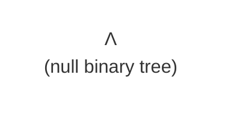

#### One-Node Binary Tree


#### Two Node Binary Tree

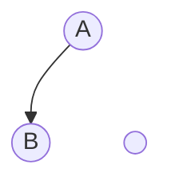

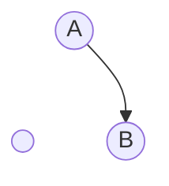

#### Skewed Binary Tree

A skewed binary tree exclusively uses either $LEFT$ or $RIGHT$ pointers, forming a diagonal path.

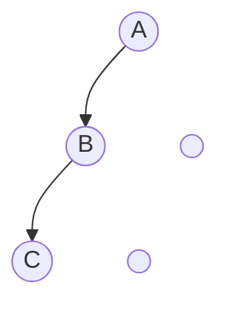

#### Strictly Balanced Binary Tree

A strictly binary tree is a binary tree where every node has either exactly two subtrees or none at all. The total number of nodes is always odd.

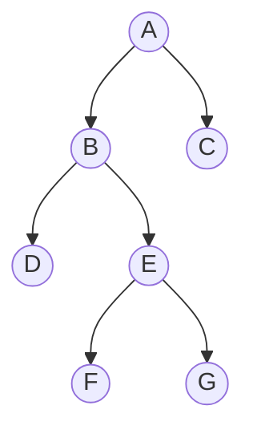

### Traversal

Being a form of graph, the Depth First Search algorithm (as defined in [1, Ch. 9, pp. 253-264]) also applies for the binary tree. Since the binary tree only has at most two children per node, the traversal is simplified enough to define three common formats, as explained in [1, Ch. 6, pp. 150-151].

Consider the following tree $T$ that will be used to demonstrate the three types of traversals for a binary tree.

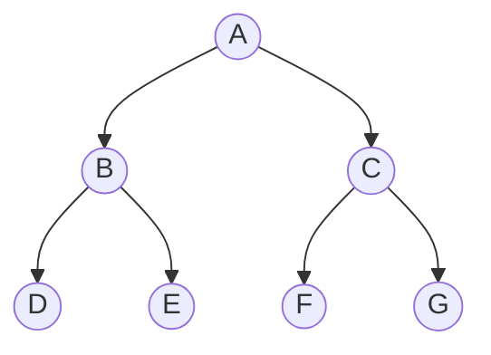

#### Preorder Traversal

For a given root $\alpha$, the preorder traversal operates on the principle of traversing the root first $\alpha$, then traversing its left child $l$. If $l$ still has a left child $l'$, then that gets traversed as well, continuing down the left branch. Once a $\Lambda$ is reached, the traversal backtracks to check the right node $r$ of the most recent parent node. In other words, the priority for traversal is $root \to left \to right$.

In the given example, the first letter to be traversed would be the root $A$.

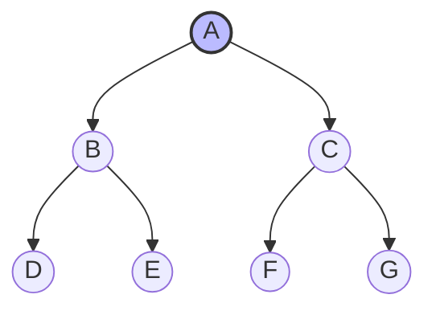

The next priority is the current root's left $l$, which is $B$.

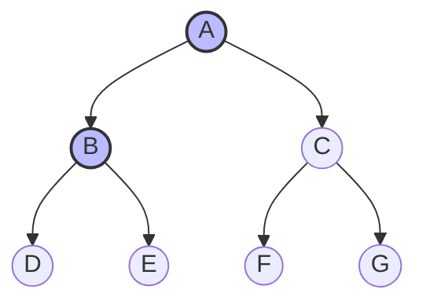

Since there is still a possible left traversal $l''$, the traversal moves to $D$.

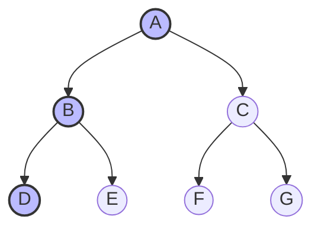

At this point, all leftmost traversals are exhausted. There are no right children either for $D$. Thus, the traversal backtracks to $B$. It's root and left values have already been processed, but it still has a right child $r=E$.

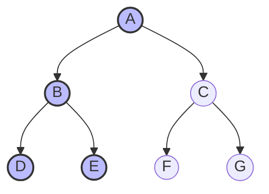

The node $E$ does not have any children so the algorithm must backtrack to $B$. This node and its descendants have already been exhausted so it backtracks to $A$. This node still has a right child $C$. In the same principle as before, $F$ and $G$ will come next.

$$
	A \to B \to D \to E \to C \to F \to G
$$

#### Inorder Traversal

For a given root $\alpha$, the inorder traversal operates on the principle of traversing the left subtree first ($l$), then processing the root itself ($\alpha$), and finally traversing its right child ($r$). If $l$ has its own left child $l'$, the traversal must continue diving left until a null node $\Lambda$ is reached before any processing occurs. In other words, the priority for traversal is $left \to root \to right$.

In the given example, starting at root $A$, the algorithm cannot process $A$ immediately. It must first dive to its left child $B$, and then to $B$'s left child $D$. Since $D$ has no left child, it is the first processed node.

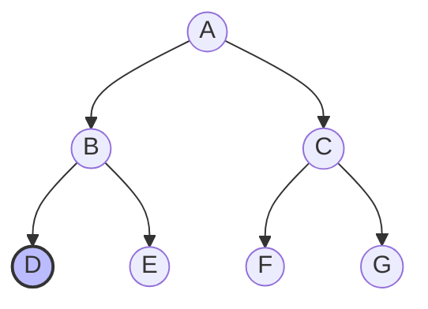

Node $D$ has no right child either, so the traversal backtracks to its parent $B$. Because $B$'s entire left subtree is fully processed, root $B$ is processed next.

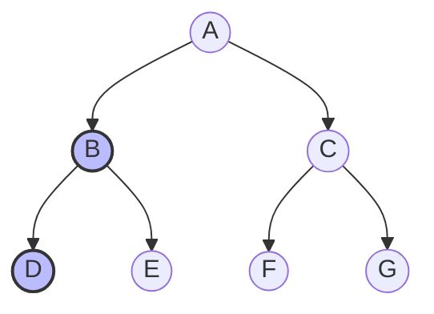

The algorithm now moves to $B$'s right child $E$. Since $E$ has no left child, $E$ is processed.

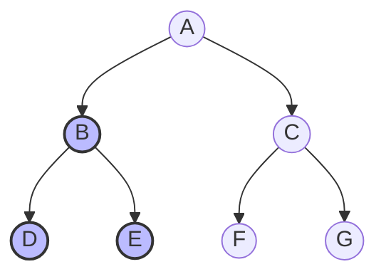

With B's entire subtree complete, the algorithm backtracks to main root $A$. Since A's left subtree is finished, root $A$ is processed next.


The traversal then moves to $A$'s right child $C$. Following the same principle, it dives to $C$'s left child $F$, processes $F$, backtracks to process $C$, and finally moves to process $G$.

$$D \to B \to E \to A \to F \to C \to G$$

#### Post Order Traversal

For a given root $\alpha$, the post order traversal operates on the principle of traversing the left subtree first ($l$), then traversing the right subtree ($r$), and finally processing the root itself ($\alpha$). If $l$ has its own subtrees, those subtrees must be completely traversed before any parent node can be processed. In other words, the priority for traversal is $left \to right \to root$.

In the given example, starting at root $A$, the algorithm cannot process A immediately. It must first dive down to its left child $B$, and then to $B$'s left child $D$. Since node $D$ has no left or right children, it is processed first.


The algorithm backtracks to parent $B$, but cannot process $B$ yet because $B$ still has an unvisited right child $E$. It moves to $E$, which has no children, so $E$ is processed next.

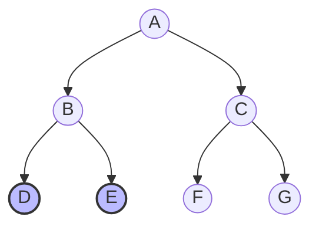

Now that both the left child and right child have been processed, the algorithm backtracks to process root $B$.


The traversal backtracks to main root $A$, but A cannot be processed yet because its right subtree is untouched. The traversal moves to A's right child $C$, and then dives to $C$'s left child $F$. Since $F$ has no children, $F$ is processed, followed by $C$'s right child $G$. Only then can $C$ be processed.

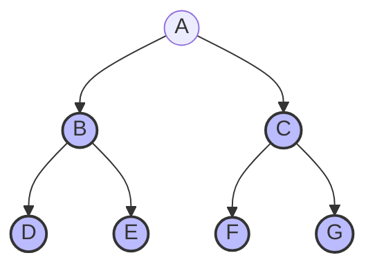

Finally, the algorithm backtracks to the root node and processes it.

$$
	D \to E \to B \to F \to G \to C \to A
$$

## Binary Search Tree

### Description

As defined in [1, Ch. 14, p. 448], Binary Search Trees (BST) are binary trees that ensure a natural order wherein left children are lower than their parents and right children are greater than their parents.

> [!NOTE] Data Structures
> A *Binary Search Tree* is a Binary Tree with keys assigned to its nodes such that if $k$ is the key at some node, say node $\alpha$, then all the keys in the left subtree of node $\alpha$ are less than $k$ and all the keys in the right subtree of $\alpha$ are greater than $k$.

Conceptually, BST search applies the same divide-by-order principle as the Binary Search algorithm.

Note that because nodes store explicit keys $k$ in the definition, the definition statement expands slightly, as in [1, Ch. 14, p. 450].

$$
	\text{Binary Tree}: [(DATA, KEY, LEFT, RIGHT), T]
$$

For simplicity, this assessment assumes that $DATA$ directly serves as key $k$. The operational logic and asymptotic complexity remain identical regardless of this omission. Additionally, duplicate values are not given focus in the analysis under the assumption that key uniqueness is enforced or duplicate handling occurs in $O(1)$ time.

### BST Insertion and Construction

#### Balanced Binary Search Tree

Consider the following sequence of numbers.

$$
	[40, 20, 60, 10, 30, 50, 70]
$$

**Insert $40$:** Establish the root node

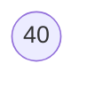

**Insert $20$:** Since $20 < 40$, it branches to the left.

```mermaid
graph TD
    B1((40)) --> B2((20))
    B1 --> B3(( ))
```

**Insert $60$:** Since $60 > 40$, it branches to the right.

```mermaid
graph TD
    B1((40)) --> B2((20))
    B1 --> B3((60))
```

**Insert $10$**: Since $10 < 40$, it branches to the left of $40$. But, since $10 < 20$, it branches to the left of $20$.

```mermaid
graph TD
    B1((40)) --> B2((20))
    B1 --> B3((60))
    B2 --> B4((10))
    B2 --> B5(( ))
```

**Insert $30$**: Since $30 < 40$, it branches to the left of $40$. But, since $30 > 20$, it branches to the right of $20$.

```mermaid
graph TD
    B1((40)) --> B2((20))
    B1 --> B3((60))
    B2 --> B4((10))
    B2 --> B5((30))
```

**Insert $50$ and $70$:** The last two numbers $50$ and $70$ go to the left and right of $60$ respectively.

```mermaid
graph TD
    D1((40)) --> D2((20))
    D1 --> D3((60))
    D2 --> D4((10))
    D2 --> D5((30))
    D3 --> D6((50))
    D3 --> D7((70))
```

#### Skewed Binary Search Tree

Now, consider the following sorted sequence. This has less elements than the first example.

$$
[10, 20, 30, 40]
$$

**Insert $10$**: Establishes the root node.

```mermaid
graph TD
    A1((10))
```

**Insert $20$**: Since $20 > 10$, it branches right of $10$.

```mermaid
graph TD
    B1((10)) -->  X(( ))
    B1 -->  B2((20))
```

**Insert $30$:** Traversal begins at the root $10$. Since $30$ is greater than $10$, move to the right of $10$ instead. Checking against $20$, $30$ is also greater than $20$, so it is placed in the right.

```mermaid
graph TD
    C1((10)) --> X1(( ))
    C1 --> C2((20))
    C2 --> X2(( )) 
    C2 --> C3((30))
```

**Insert $40$:** The same thing applies. In fact, had the sequence continued, it would result in a tree with more height or level.

```mermaid
graph TD
    C1((10)) --> X1(( ))
    C1 --> C2((20))
    C2 --> X2(( )) 
    C2 --> C3((30))
    C3 --> X3(( ))
    C3 --> C4((40))
```

Despite having less nodes $v$ than the previous example, the height is larger due to the skewing. This is also true if the sequence was in decreasing order, the only difference being the direction of the skewing.

In other words, a more unbalanced BST will cause larger $h$. This intuition will haunt us later.

### Searching in a Binary Search Tree

A reasonable operation to expect after building a BST is to searching for a key $x$ if it is in the BST.

To search for target key $x$, traversal follows four simple rules at each active node $\alpha$. These rules allow the algorithm to discard one entire subtree after every comparison.

$$
\text{Rules at node } \alpha: \begin{cases} \alpha = \Lambda & \text{Search Failure} \\ x = \text{DATA}(\alpha) & \text{Search Success} \\ x < \text{DATA}(\alpha) & \text{Traverse } \text{LEFT}(\alpha) \\ x > \text{DATA}(\alpha) & \text{Traverse } \text{RIGHT}(\alpha) \end{cases}
$$

Consider searching for key $x = 30$ in the balanced BST:

$$
	[40, 20, 60, 10, 30, 50, 70]
$$

```mermaid
graph TD
    A1((40)) --> A2((20))
    A1 --> A3((60))
    A2 --> A4((10))
    A2 --> A5((30))
    A3 --> A6((50))
    A3 --> A7((70))
```

**Step 1**: Compare $x = 30$ at Root $40$. Since $30 < 40$, traverse left.

```mermaid
graph TD
    A1((40)) --> A2((20))
    A1 --> A3((60))
    style A1 fill:#f9f,stroke:#333,stroke-width:2px
    style A2 fill:#bbf,stroke:#333,stroke-width:2px
```

**Step 2**: Compare $x = 30$ at Node $20$. Since $30 > 20$, traverse right.

```mermaid
graph TD
    A1((40)) --> A2((20))
    A1 --> A3((60))
    A2 --> A4((10))
    A2 --> A5((30))
    A3 --> A6((50))
    A3 --> A7((70))
    
    style A1 fill:#f9f,stroke:#333,stroke-width:2px
	style A2 fill:#f9f,stroke:#333,stroke-width:2px
    style A5 fill:#bbf,stroke:#333,stroke-width:2px
```

**Step 3**: Compare $x = 30$ at Node $30$. Match found ($30 = 30$).

> [!NOTE] Unfound Item
> When searching for unindexed values (e.g., $x = 25$), traversal proceeds down to node $30$. The process evaluates $25 < 30$ and steps into $\text{LEFT}(30)$. Because $\text{LEFT}(30) = \Lambda$, the execution terminates with a failure signal.

### Deletion Example

In the attempt to delete a node $\alpha \in T$, the first step is to locate the node. This can be done with the same steps as in the previous section. After this, there are three cases to mainly consider, as noted in [1, Ch. 14, pp. 452 - 454].

#### Childless Deletion

Consider the following tree $T$ wherein $\alpha=20$. Since it doesn't have any children, deleting $\alpha$ would simply need to cut its connection with its parent $\omega = 40$.

```mermaid
graph TD
    A1((40)) --> A2((20))
    A1 --> A3((60))
    A3 --> A6((50))
    A3 --> A7((70))
    
    style A1 fill:#f9f,stroke:#333,stroke-width:2px
	style A2 fill:#bbf,stroke:#333,stroke-width:2px
```

```mermaid
graph TD
    A1((40)) --> A2(( ))
    A1 --> A3((60))
    A3 --> A6((50))
    A3 --> A7((70))
    
    style A1 fill:#f9f,stroke:#333,stroke-width:2px
	style A2 fill:#bbf,stroke:#333,stroke-width:2px
```

#### Deletion with Single Child

Consider the following tree $T$ wherein $\alpha=20$.

```mermaid
graph TD
    A1((40)) --> A2((20))
    A1 --> A3((60))
    A2 --> A4((10))
    A2 --> A5(( ))
    
    style A2 fill:#f9f,stroke:#333,stroke-width:2px
	style A4 fill:#bbf,stroke:#333,stroke-width:2px
```

There are no orphans in a Binary Search Tree. If the parent of descendant nodes was removed, it would also sever them from the tree.

```mermaid
graph TD
    A1((40)) --> A2(( ))
    A1 --> A3((60))
    A4((10))
    
    style A2 fill:#f9f,stroke:#333,stroke-width:2px
	style A4 fill:#bbf,stroke:#333,stroke-width:2px
```

Only a node with two children requires a replacement key. However, the main challenge is to delete $\alpha$ without violating the two main rules of a Binary Search Tree:
- For a node $\alpha$, values in the left subtree $l$ must all have smaller values than $\alpha$
- For a node $\alpha$, values in the right subtree $r$ must all have larger values than $\alpha$

Given the node $\alpha$, its parent $\omega$ and sibling $\alpha'$, the sibling and its descendants cannot become replacements for $\alpha$. This is because $\omega$ partitions its subtrees based on value. In other words, all nodes in the subtree rooted at $\alpha'$ lie on the wrong side of $\omega$'s threshold relative to $\alpha$'s position.

For example, if $\alpha$ is the right child of $\omega$ ($\alpha > \omega$), all nodes in the left subtree rooted at $\alpha'$ are strictly less than $\omega$, so moving any of them to $\alpha$'s position would violate the BST rules. Symmetrically, the same applies if $\alpha$ is a left child. This immediately eliminates the sibling's entire subtree from consideration.

The only child $\gamma$ simply takes the position previously occupied by $\alpha$. Since $\gamma$ is in the same subtree as $\alpha$ is for $\omega$, it is also less or greater than $\omega$ as $\alpha$ originally is. Thus, no BST rule is violated. Considering descendants of $\gamma$ would be unnecessary (and the next section proves they are not valid either way).

The node $\alpha$ is removed by connecting its parent directly to its only child $\gamma$. If $\alpha$ is the root, $\gamma$ becomes the new root.

#### Deletion with Two Children

In a more balanced BST, it's possible for a node $\alpha$ to have more than one children: $l, r$. Consider a more expanded example for $T$.

```mermaid
graph TD
    A1((20))
    A1 --> A3((10))
    A1 --> A2((30))
    A3 --> A4((05))
    A3 --> A5((15))
	A2 --> A8((25))
    A2 --> A9((35))
    
	style A1 fill:#bbf,stroke:#333,stroke-width:2px
```

For the same reason as in the previous case, the sibling $\alpha'$ and its descendants are not viable candidates. This still leaves a bit of family drama as there are multiple candidates to consider within the descendants of $\alpha$.

Not all descendants can be candidates.

Immediate children are not necessarily valid replacements. For example, $10$ can't be a valid candidate. It already has $r=15$ so it cannot accommodate $30$ for another $r$. Due to the symmetry, the same can be said for $30$ that cannot accommodate another $l$.

Seeing the issues with handling sub-trees, it might seem the nodes with single or no children are all valid solutions. However, that's not necessarily true. For example, the BST minimum $05$ cannot be a substitute since it cannot let $l=10$ without violating BST rules. The same can be said for the maximum, $35$, that can't let $r=30$.

As suggested in [1, pp. 452-453], the valid replacement is a node with at most one child to avoid the issue with sub-tree placement and it also needs to be close enough to the original value of $\alpha$ such that no BST rules can be violated.

To preserve the BST invariant, the replacement key must be greater than every key in $\alpha$'s left subtree and smaller than every key in $\alpha$'s right subtree.

Let $L$ and $R$ denote the sets of keys contained in $\alpha$'s left and right subtrees, respectively. By the BST invariant,

$$
	\forall l \in L, l \lt \alpha
$$

$$
	\forall r \in R, r \gt \alpha
$$

For $x$ to be a valid replacement for $\alpha$, it must satisfy the BST rules for both subtrees simultaneously. Formalizing the intuition used since the last sections:
1. $\forall l \in L, \, l < x \implies \alpha - a < x$
2. $\forall r \in R, \, r > x \implies \alpha + b > x$

Consider the option to choose from $R$. Let $x = \alpha + b^* \in R$
- The first requirement holds trivially because $\alpha - a < \alpha < \alpha + b^*$ for all $a > 0$. The left side is subtracting so $x$ is always greater.
- The second requirement demands that $\forall b \neq b^*$, if $\alpha + b \in R$, then $\alpha + b > \alpha + b^* \implies b > b^*$.

This condition holds if and only if $b^* = \min(\{b \mid \alpha + b \in R\})$.

If any second-smallest $b'$ is chosen instead, there exists at least one node in $R$ with $b^* < b'$, creating an element $\alpha + b^* \in R$ such that $\alpha + b^* < x$. This forces a smaller value into $x$'s right subtree, violating the BST invariant.

Consider the option to choose from $L$. By symmetric logic, choosing $x = \alpha - a^* \in L$ holds if and only if $a^* = \min(\{a \mid \alpha - a \in L\})$, which is the maximum value in $L$ (due to subtraction).

Thus, $x$ has to be either the largest of $L$ or the smallest of $R$. In other words, it has to be the two closest values to $\alpha$ such that $a^*, b^*$ are minimized.

This is why for $\alpha=20$, $x=15$ and $x=25$ are the only valid successors. The $\alpha=15$ is large enough to still be greater than all $l$ but definitely smaller for all $r$. Conversely, $25$ is definitely larger than all $l$ but small enough to be less than all $r$. The successors here are called in-order predecessor and in-order successor respectively.

The in-order successor has no left child because any left child would have a smaller key, contradicting its status as the minimum of the right subtree. Therefore, it has at most one child and can be removed using the zeroor one-child deletion case.

Additionally, an implicitly required process is to find either the minimum or maximum, depending on whether in-order predecessor or in-order successor is used, is finding the smallest or largest of a given subtree. This was described in [1, Ch. 14, p. 451].

### Extreme Finding Example

Consider searching for the minimum or maximum key $x$ in the balanced BST:

```mermaid
graph TD
    A1((40)) --> A2((20))
    A1 --> A3((60))
    A2 --> A4((10))
    A2 --> A5((30))
    A3 --> A6((50))
    A3 --> A7((70))
```

As discussed in the previously submitted assessment and explained in [3, pp. 253 - 270], standard graph traversals rely on Breadth-First Search (BFS) and Depth-First Search (DFS).

Given the designation of the right child $r$ being the larger subtree for all nodes $\alpha \in T$, following right-child pointers until $\Lambda$ is encountered. By symmetry, finding the minimum key requires traversing the immediate left children until $\Lambda$ is reached.

```mermaid
graph TD
    A1((40)) --> A2((20))
    A1 --> A3((60))
    A2 --> A4((10))
    A2 --> A5((30))
    A3 --> A6((50))
    A3 --> A7((70))
    
style A2 fill:#f9f,stroke:#333,stroke-width:2px
style A4 fill:#f9f,stroke:#333,stroke-width:2px
style A3 fill:#bbf,stroke:#333,stroke-width:2px
style A7 fill:#bbf,stroke:#333,stroke-width:2px
```

### Implementation

#### Helper Procedures

Rather than isolating tree search, insertion, and deletion into independent algorithms, as done in [1, Ch. 14, pp. 450-454], this assessment uses two shared internal procedure called $BST\_DIVE$ and $BST\_PARENT$. These helper procedures mainly traverse the tree in search of value $x$ within $DATA$ of the nodes.

#### Traversal Procedure

In the $BST\_DIVE$ procedure, there are three terminating cases:
- **Empty Tree ($T = \Lambda$)**: The loop body is skipped and the procedure returns $\omega =\Lambda$.
- **Key Match ($x \in T$)**: The loop halts upon locating value $x$ and returns the matching node $\alpha$ where $DATA(\alpha) = x$.
- **Key Absent ($x \notin T$)**: Pointer $\alpha$ steps into $\Lambda$ and returns pointer $\omega$, which is the last non-null node traversed before reaching $\alpha$.

```pseudo
\begin{algorithm}
\begin{algorithmic}
\Procedure{BST_DIVE}{T, x}
\State $\omega \gets \Lambda$
\State $\alpha \gets T$

\While{$\alpha \neq \Lambda$ \textbf{and} $\text{DATA}[\alpha] \neq x$}
    \State $\omega \gets \alpha$
    \If{$x < \text{DATA}[\alpha]$}
        \State $\alpha \gets \text{LEFT}[\alpha]$
    \Else
        \State $\alpha \gets \text{RIGHT}[\alpha]$
    \EndIf
\EndWhile

\If{$\alpha \neq \Lambda$}
    \State \Return $\alpha$
\EndIf

\State \Return $\omega$
\EndProcedure
\end{algorithmic}
\end{algorithm}
```

> [!Note] Output Format
> It does seem like the search algorithm already but the key difference is that its third terminating state can return $\omega$, which is not needed by a valid algorithm that only needs to find $x$.

> [!TIP] Procedure Naming
> Binary Trees are often drawn from root first and moving downwards towards the terminating nodes. This is why DIVE was used, even though CLIMB would be thematically correct since you can't dive into a tree.

#### Meeting the Parent

The $BST\_PARENT$ procedure is just a variant of $BST\_DIVE$, except the last conditional check returns $\omega$ instead of $\alpha$.

```pseudo
\begin{algorithm}
\begin{algorithmic}
\Procedure{BST_PARENT}{T, x}
\State $\omega \gets \Lambda$
\State $\alpha \gets T$

\While{$\alpha \neq \Lambda \text{ and } \text{DATA}[\alpha] \neq x$}
    \State $\omega \gets \alpha$
    \If{$x < \text{DATA}[\alpha]$}
        \State $\alpha \gets \text{LEFT}[\alpha]$
    \Else
        \State $\alpha \gets \text{RIGHT}[\alpha]$
    \EndIf
\EndWhile

\If{$\alpha \neq \Lambda$}
    \State \Return $\omega$
\EndIf

\State \Return $\Lambda$
\EndProcedure
\end{algorithmic}
\end{algorithm}
```

#### Search Procedure

Now, when implementing $BST\_SEARCH$, if $BST\_DIVE$ returns $\Lambda$, then the search failed and $\Lambda$ is propagated. If search succeeded, the procedure returns $\alpha$. In the case $\omega$ is returned, the $DATA(x)$ is checked first. If not equal to $x$, it is indeed $\alpha$ and warrants the default $\Lambda$ return.

```pseudo
\begin{algorithm}
\begin{algorithmic}
\Procedure{BST_Search}{$T, x$}
\State $\alpha \gets$ \Call{BST_DIVE}{$T, x$}
\If{$\alpha \neq \Lambda \text{ and } \text{DATA}(\alpha) = x$}
    \State \Return $\alpha$
\EndIf
\State \Return $\Lambda$
\EndProcedure
\end{algorithmic}
\end{algorithm}
```

#### Insert Procedure

When implementing $BST\_INSERT$, wherein it asks for the binary tree $T$ and node to insert $\ell$, the $BST\_DIVE$ will again either return $\Lambda$ or an actual node $\delta$. The algorithm's goal is to get $\Lambda$ or $\omega$ from $BST\_DIVE$.
- Case $\delta=\Lambda$ can only happen if $T = \Lambda$. This can be checked immediately and, upon confirmation, sets $T$ to $\ell$ for an essentially new root node.
- On $\delta = \omega$, the node just gets an updated $LEFT$ or $RIGHT$ value.
- On $\delta = \alpha$, meaning there is a non-unique node, the algorithm stops. An alternative move would be to add actual duplicate value handling.

```pseudo
\begin{algorithm}
\begin{algorithmic}
\Procedure{BST_INSERT}{$T, \alpha$}
\If{$T = \Lambda$}
    \State $T \gets \alpha$
    \State \Return
\EndIf

\State $\delta \gets$ \Call{BST_DIVE}{$T, \text{DATA}(\alpha)$}

\If{$\text{DATA}(\delta) = \text{DATA}(\alpha)$} \Comment{Duplicate key}
    \State \Return
\ElsIf{$\text{DATA}(\delta) > \text{DATA}(\alpha)$}
    \State $\text{LEFT}(\delta) \gets \alpha$
\Else
    \State $\text{RIGHT}(\delta) \gets \alpha$
\EndIf
\EndProcedure
\end{algorithmic}
\end{algorithm}
```

#### Extreme Finding

Implementing $BST\_MIN$ just requires traversing every immediate left child $l$ until a $\Lambda$ is reached. Whereas implementing $BST\_MAX$ will need to traverse every immediate right child $r$ until a $\Lambda$ is reached.

```pseudo
\begin{algorithm}
\begin{algorithmic}

\Procedure{BST_MIN}{T}
	\If{$T = \Lambda$}
		\Return $\Lambda$ 
	\EndIf
	
	\State $x \gets T$
	
	\While{\Call{LEFT}{$x$} $\neq \Lambda$}
		\State $x \gets$ \Call{LEFT}{$x$}
	\EndWhile
	
	\Return $x$
\EndProcedure

\end{algorithmic}
\end{algorithm}
```

```pseudo
\begin{algorithm}
\begin{algorithmic}
\Procedure{BST_MAX}{T}
	\If{$T = \Lambda$}
		\Return $\Lambda$ 
	\EndIf
	
	\State $x \gets T$
	
	\While{\Call{RIGHT}{$x$} $\neq \Lambda$}
		\State $x \gets$ \Call{RIGHT}{$x$}
	\EndWhile
	
	\Return $x$
\EndProcedure

\end{algorithmic}
\end{algorithm}
```

#### Delete Procedure

This is the most complicated procedure for the Binary Search Tree so far. It uses three helper procedures: $BST\_DIVE$, $BST\_MIN$ and $BST\_PARENT$. Three main points in the code summarize the details of the algorithm:
- If $T = \Lambda$ or $x \not\in T$ then $\alpha$ will either be $\Lambda$ or $\omega$. This will trigger a return from the first condition and prematurely stop the algorithm.
- If $\alpha$ has two children, then the complex part of the algorithm occurs:
	- Find the successor $\beta$ as the minimum of the right subtree $R$
	- Find the parent $\omega$ of the successor
	- Update $\alpha$ to have the value of $\beta$. Subtree changes occur after
	- Unlink $\beta$ from the tree $T$
- If $\omega = \Lambda$, this means $\alpha$ is already the root node. Thus, the single child $\gamma$ is the new $T$.
- If $\omega \ne \Lambda$, then the previous spot of $\alpha$ is just replaced by $\gamma$

```pseudo
\begin{algorithm}
\begin{algorithmic}

\Procedure{BST_DELETE}{$T, x$}
	\State $\alpha \gets$ \Call{BST_DIVE}{$T, x$}
	\If{$\alpha = \Lambda \textbf{ or }$ \Call{DATA}{$\alpha$} $\neq x$}
		\Return
	\EndIf
	
	\If{\Call{LEFT}{$\alpha$} $\neq \Lambda \textbf{ and }$ \Call{RIGHT}{$\alpha$} $\neq \Lambda$}
		\State $\beta \gets$ \Call{BST_MIN}{\Call{RIGHT}{$\alpha$}}
		\State $\omega \gets$ \Call{BST_PARENT}{$T$, \Call{DATA}{$\beta$}}
		\State \Call{DATA}{$\alpha$} $\gets$ \Call{DATA}{$\beta$}
		\State $\alpha \gets \beta$
	\Else
		\State $\omega \gets$ \Call{BST_PARENT}{$T$, \Call{DATA}{$\alpha$}}
	\EndIf
	
	\State $\gamma \gets$ \Call{LEFT}{$\alpha$}
	\If{$\gamma = \Lambda$}
		\State $\gamma \gets$ \Call{RIGHT}{$\alpha$}
	\EndIf
	
	\If{$\omega = \Lambda$}
		\State $T \gets \gamma$
	\ElsIf{\Call{LEFT}{$\omega$} $= \alpha$}
		\State \Call{LEFT}{$\omega$} $\gets \gamma$
	\Else
		\State \Call{RIGHT}{$\omega$} $\gets \gamma$
	\EndIf
	
	\Return $T$
\EndProcedure

\end{algorithmic}
\end{algorithm}
```

### Algorithmic Analysis

#### Minimum and Maximum Finding

##### Skewed Binary Search Tree

The time complexity of the $BST\_MIN$ and $BST\_MAX$ procedures depend on the number nodes that have to be traversed to reach the extreme values.

For example, if the binary search tree $T$, with height $h$ and node count $v$, is left-skewed, then $BST\_MIN$ is guaranteed to have a time complexity of $O(v)$ since it has to traverse all nodes. However, $BST\_MAX$ is a constant operation $O(1)$ in this case because the only "right" node $r$ possible is the root or its $r=\Lambda$.

By symmetry, $BST\_MIN$ is a constant operation $O(1)$ on a right-skewed binary search tree and $BST\_MAX$ has a time complexity of $O(v)$.

##### Balanced Binary Search Tree

In a balanced binary tree, nodes are distributed evenly across left and right subtrees $l, r$. The height of the tree $h$ is bounded logarithmically because every traversal halves the amount of nodes accessible. Specifically, if $v$ is the total number of nodes, then the height is bounded by $\lg{v}$.

$$
T(v, h) = O(h) = O(\lg v)
$$

#### Traversal Analysis

Since $BST\_INSERT$ and $BST\_SEARCH$ only introduce constant time operations $O(1)$ via conditional checks, $DATA, LEFT, RIGHT$ calls, and variable updates, their running time is mainly determined by the time complexity of $BST\_DIVE$ and $BST\_PARENT$.

Furthermore, $BST\_PARENT$ is just a variant of $BST\_DIVE$ so the only analysis necessary is for $BST\_DIVE$ for all four algorithms.

##### Best-Case Scenario

The optimal case for the traversal occur when $T = \Lambda$ or when the target key $x$ resides directly at the root node ($\alpha = T$). Here, the condition $\text{DATA}(T) = x$ evaluates to true on the initial check, bypassing the loop traversal entirely. Since all four algorithms only provide constant time operations beside the loop, then the best case running time is also constant time.

$$T(v, h) = O(1)$$

##### Balanced Tree Scenario

Similar to $BST\_MIN$ and $BST\_MAX$, the running time is bounded by the height $h$. Successive halving of the search space continues per step down until $x$ is found or a $\Lambda$ child is reached at depth $h + 1$. Thus, the worst case runtime for a balanced search tree scales linearly with its height.

$$T(v, h) = O(h) = O(\lg v)$$

##### Skewed Tree Scenario

In a skewed binary tree where all nodes chain in a single direction, stepping down a level fails to eliminate half of the candidates because the off-side sub trees are empty. If the target element lies at the deepest node or is absent from the tree, the traversal must inspect every node $v$ sequentially:

$$
	T(v, h) = O(h) = O(v)
$$

### Deletion Analysis

All the previous algorithms scaled at $O(h)$. In a small height like $h=0$ or $h=1$, the absolute best case scenario occurs for all helper functions $BST\_MIN, BST\_DIVE, BST\_SEARCH$. Combining this with the other constant time operations of $BST\_DELETE$, the running time is still constant.

$T(v, h) = O(1)$

The fundamental running-time bound for BST operations is $O(h)$, where $h$ is the tree height.

A height-balanced BST has $h=\lg{v}$, giving $O(\lg{v})$ operations. An unbalanced BST can have $h=O(v)$, giving $O(v)$ operations.

Note that the edge finder can be constant time $O(1)$ depending on the direction, but the two other helpers will still provide linear complexity.

## Expression Tree

An Expression Tree is formally defined in [1, Ch. 6, p. 152] as a specialized application of a binary tree used to represent algebraic, arithmetic, or logical expressions. The leaf nodes of an expression tree represent operands (constants or variables), whereas the internal nodes represent binary operators (such as $+$, $-$, $*$, $/$, or $\wedge$).

As with standard binary trees, the structure is declared with pointer $T$ to the root node. Similar to the previous section, the $KEY$ is omitted in favor of only using the $DATA$ call.

$$\text{Expression Tree}: [(\text{LEFT}, \text{DATA}, \text{RIGHT}), T]$$

Consider the following expression.

$$
	A ∗ (B + (C − D)/Eˆ2) + F
$$

Evaluating it requires processing operations sequentially. Using binary trees as expression trees, evaluating just becomes a problem of how to traverse the tree, as explained in [1, Ch. 6, p. 152].

Here is an example of the same expression as an expression tree:

```mermaid
graph TD
    A1((+)) 
    A1 --> A2(("*"))
    A1 --> A13((F))
    A2 --> A3((A))
    A2 --> A4(("+"))
    A4 --> A5((B))
    A4 --> A6(("/"))
    A6 --> A7(("-"))
    A7 --> A8((C))
    A7 --> A9((D))
    A6 --> A10(("^"))
    A10 --> A11((E))
    A10 --> A12((2))
```

### Mathematical Notation

The mathematical representation of an expression directly corresponds to how its expression tree is traversed. Tree traversal algorithms systematically visit every node in the hierarchy.

To illustrate how traversal order defines mathematical notation, consider the subexpression tree for $(a + b) * (c - d)$:

```mermaid
graph TD
    R(("*"))
    R --> L(("+"))
    R --> RR(("-"))
    L --> LA((a))
    L --> LB((b))
    RR --> RA((c))
    RR --> RB((d))
```

#### Infix Notation

The Infix Notation places operators between their operands. It is produced by performing an inorder traversal across the tree.

The tree structure explicitly represents the grouping imposed by operator precedence. An inorder traversal recovers the operator/operand ordering, but parentheses may be required to preserve the grouping represented by the tree. This is explicitly warned in [1, Ch. 6, p. 152]. Parentheses must be added programmatically during node visits.

#### Postfix Notation

The Postfix notation (Reverse Polish Notation) places operators after their operands. It is produced by performing a Postorder Traversal. The earlier expression will be converted to the following:

$$\text{a b + c d - *}$$

As noted in [2, Ch. 2, p. 53], postfix notation is unambiguous because the position of each operator determines which preceding operands or subexpressions it consumes.

> [!Warning] Decided Notation
> This assessment will use postfix notation to avoid the algorithmic complexity of injecting parentheses during tree traversal and evaluation.

### Expression Tree Construction

Constructing an expression tree from a postfix expression utilizes a stack $\mathbb{S}$ to maintain pointers to subtrees. Operands are treated as leaf nodes and pushed directly onto $\mathbb{S}$. When an operator $\alpha$ is encountered, its two required subtrees are popped from $\mathbb{S}$, assigned as its children ($l$ and $r$), and the combined subtree root $\alpha$ is pushed back onto $\mathbb{S}$.

Remember that for the given expression, the expected binary tree is the following:

```mermaid
graph TD
    R(("*"))
    R --> L(("+"))
    R --> RR(("-"))
    L --> LA((a))
    L --> LB((b))
    RR --> RA((c))
    RR --> RB((d))
```

**First Step:** The algorithm reads the operand $a$. A single leaf node $a$ is created and its pointer is pushed onto $\mathbb{S}$.

```mermaid
graph TD
    LA((a))
```

**Second Step:** The algorithm reads the operand $b$. A single leaf node $b$ is created and its pointer is pushed onto $\mathbb{S}$. The stack now contains two distinct subtrees $[a, b]$.

```mermaid
graph TD
    LA((a))
    LB((b))
```

**Third Step:** The algorithm reads the operator $+$. It pops the top element $b$ to serve as the right child $r$, and pops the next element $a$ to serve as the left child $l$. A new operator root node $+$ is created linking both children ($l \to + \leftarrow r$). The pointer to this subtree is pushed onto $\mathbb{S}$.

```mermaid
graph TD
    P1(("+"))
    P1 --> LA((a))
    P1 --> LB((b))
```

**Fourth Step:** The algorithm reads the operand $c$. A leaf node $c$ is created and its pointer is pushed onto $\mathbb{S}$.

```mermaid
graph TD
    P1(("+"))
    P1 --> LA((a))
    P1 --> LB((b))
    RA((c))
```

**Fifth Step:** The algorithm reads the operand $d$. A leaf node $d$ is created and its pointer is pushed onto $\mathbb{S}$. The stack currently holds three elements $[(a + b), c, d]$.

```mermaid
graph TD
    P1(("+"))
    P1 --> LA((a))
    P1 --> LB((b))
    RA((c))
    RB((d))
```

**Sixth Step:** The algorithm reads the operator $-$. It pops $d$ as its right child $r$ and $c$ as its left child $l$. A new operator node $-$ is formed linking both nodes, and the resulting subtree is pushed onto $\mathbb{S}$. The stack now holds two composite subtrees $[(a + b), (c - d)]$.

```mermaid
graph TD
    P1(("+"))
    P1 --> LA((a))
    P1 --> LB((b))
    P2(("-"))
    P2 --> RA((c))
    P2 --> RB((d))
```

**Seventh Step:** The algorithm reads the operator $*$. For the same rules as $-$, the final form of the expression tree is achieved.

```mermaid
graph TD
	P0(("*")) --> P1(("+"))
	P0 --> P2
    P1 --> LA((a))
    P1 --> LB((b))
    P2(("-"))
    P2 --> RA((c))
    P2 --> RB((d))
```

### Expression Tree Evaluation

When applied to an expression tree, binary tree traversal algorithms convert the two-dimensional hierarchical tree into a one-dimensional mathematical string [1, Ch. 6, pp. 150-151].

Consider the earlier expression tree $T$ representing the expression $(a + b) * (c - d)$:

```mermaid
graph TD
    R(("*")) 
    R --> L(("+"))
    R --> RR(("-"))
    L --> LA((a))
    L --> LB((b))
    RR --> RA((c))
    RR --> RB((d))
```

For a given root $\alpha$, the preorder traversal operates on the principle of visiting the root first $\alpha$, then traversing its left child $l$, and finally traversing its right child $r$. In an expression tree, executing a preorder traversal yields the Prefix Notation, as visited in [2, Ch. 2, pp. 57-60].

### Implementation

#### Construction

The $\text{ET\_BUILD}$ procedure constructs an expression tree from an array of postfix tokens $E$ of length $n$. The algorithm iterates left-to-right through token array $E$:
1. **Operand Token ($x \notin \text{Operators}$):** A leaf node $\alpha$ is created with children $\Lambda$ and pushed onto $\mathbb{S}$.
2. **Operator Token ($x \in \text{Operators}$):** The top two subtrees are popped from $\mathbb{S}$.

The first popped node represents the right child $r$, and the second popped node represents the left child $l$. An operator node $\alpha$ is created linking both subtrees and pushed back onto $\mathbb{S}$.

In non-commutative operations (such as subtraction $c - d$ or division $c / d$), operand order is critical. Because $d$ is pushed onto stack $\mathbb{S}$ after $c$, popping $\mathbb{S}$ yields $d$ first. Assigning $d$ as $\text{RIGHT}(\alpha)$ and $c$ as $\text{LEFT}(\alpha)$ guarantees structural accuracy.

```pseudo
\begin{algorithm}
\begin{algorithmic}
	\Procedure{ET_BUILD}{$E, n$}
		\State $\mathbb{S} \gets$ \Call{INIT_EMPTY_STACK}{ }
		
		\For{$i \gets 1 \textbf{ to } n$}
			\State $x \gets E[i]$
			\If{\Call{IS_OPERATOR}{$x$}}
				\State $r \gets$ \Call{POP}{$\mathbb{S}$}
				\State $l \gets$ \Call{POP}{$\mathbb{S}$}
				\State $\alpha \gets$ \Call{CREATE_NODE}{$x, l, r$}
				\State \Call{PUSH}{$\mathbb{S}, \alpha$}
			\Else
				\State $\alpha \gets$ \Call{CREATE_NODE}{$x, \Lambda, \Lambda$}
				\State \Call{PUSH}{$\mathbb{S}, \alpha$}
			\EndIf
		\EndFor
		
		\State \Return \Call{POP}{$\mathbb{S}$}
	\EndProcedure
\end{algorithmic}
\end{algorithm}
```

#### Evaluation

Evaluating an expression tree also leverages post order traversal. Subtrees are evaluated recursively down to operand leaves before applying operator operations at internal nodes. The procedure $\text{APPLY\_OP}(\text{op}, a, b)$ computes the arithmetic result of operator $\text{op}$ over numerical operands $a$ and $b$.

```pseudo
\begin{algorithm}

\begin{algorithmic}

\Procedure{ET_EVAL}{$T$}

\If{$T = \Lambda$}

\State \Return $0$

\EndIf

\If{\Call{LEFT}{$T$} $= \Lambda \textbf{ and }$ \Call{RIGHT}{$T$} $= \Lambda$}

\State \Return \Call{TO_NUMBER}{\Call{DATA}{$T$}}

\EndIf

\State $l \gets$ \Call{ET_EVAL}{\Call{LEFT}{$T$}}

\State $r \gets$ \Call{ET_EVAL}{\Call{RIGHT}{$T$}}

\State \Return \Call{APPLY_OP}{\Call{DATA}{$T$}, $l, r$}

\EndProcedure

\end{algorithmic}

\end{algorithm}
```

### Algorithmic Analysis

#### Construction Analysis

Given an array $P$ containing $n$ postfix tokens (where $n$ equals the total node count $v$ of the tree), the loop runs $n$ times. Within each iteration, token checking ($\text{IS\_OPERATOR}$), stack pushes/pops, and node creations perform in constant time $O(1)$. Therefore, building the tree from a postfix expression runs in linear time relative to input length.

$$T(n) = O(n)$$

#### Evaluation Analysis

For an expression tree $T$ containing $v$ total nodes and height $h$, the evaluation procedure evaluates left and right subtrees recursively before performing arithmetic at node $\alpha$. Every node is processed once, yielding linear execution time.

$$T(v) = O(v)$$

## References

1. E. P. Quiwa, *Data Structures*. Manila, Philippines: Office of the Vice-President for Academic Affairs, University of the Philippines System / Electronics Hobbyists Publishing House, 2007 (ISBN: 971-897806-1).
2. Alfred V. Aho, Monica S. Lam, Ravi Sethi, and Jeffrey D. Ullman. 2007. *Compilers: Principles, Techniques, and Tools* (2nd ed.). Addison-Wesley Longman Publishing Co., Inc.
