# CS 197 HZZQ - Assessment 05

Submitted by Stephen Sabas Singer (2019-05493) on September 8, 2026.

## Binary Trees

### Description

The Binary Tree is formally defined in the main reference [1, p. 144] as a finite set of nodes or vertices $v$, which is either empty or consists of a root $T$ and two disjoint binary trees called the left $l$ and right $r$ subtrees of the node. As agreed in this module, this can be declared with the following format where $T$ is the pointer to the root node.

$$
	\text{Binary Tree}: [(DATA, LEFT, RIGHT), T]
$$

### Terminologies

The number of edges $e$ or connections needed to reach a given node from the root node is defined as its **level**. By definition, the root node resides at level $0$. The maximum level achieved by any node defines the **height** of the binary tree.

Given the natural and familial tree analogies, terms such as *child*, *parent*, *ancestor*, and *descendant* are used to describe relations between subtrees [1, p. 145]. Nodes without any subtrees are formally referred to as **leaf** nodes.

### Nomenclatures

Like most graph structures, binary trees are best understood visually [1, pp. 147–148]. Below are common topological configurations for reference:

#### Empty Binary Tree

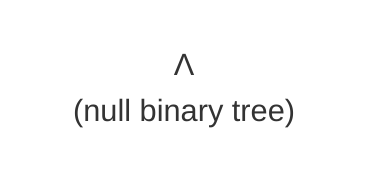

#### One-Node Binary Tree


### Two Node Binary Tree

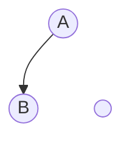

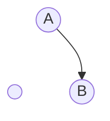

### Skewed Binary Tree

A skewed binary tree exclusively uses either $LEFT$ or $RIGHT$ pointers, forming a linear, diagonal path.

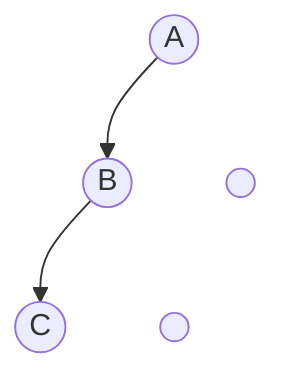

#### Strictly Balanced Binary Tree

A strictly binary tree is a binary tree where every node has either exactly two subtrees or none at all. The total number of nodes is always odd.

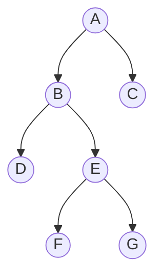

#### Perfect Binary Tree

A perfect binary tree is a strictly binary tree where all terminal (leaf) nodes reside strictly on the final level.

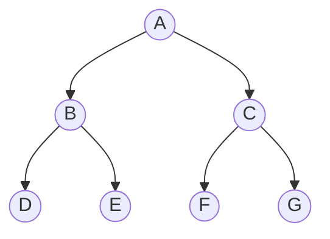

#### Complete Binary Tree

A complete binary tree is a binary tree where all terminal nodes reside at either the penultimate or last level, filled sequentially from left to right.

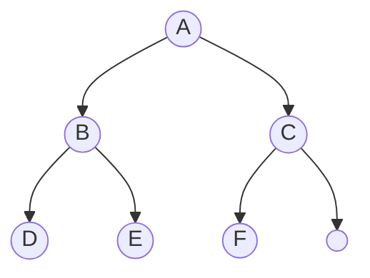

## Binary Search Tree

### Description

As excerpted from Quiwa [2, p. 448]

> [!NOTE] Data Structures, Quiwa
> A *Binary Search Tree* is a Binary Tree with keys assigned to its nodes such that if $k$ is the key at some node, say node $\alpha$, then all the keys in the left subtree of node $\alpha$ are less than $k$ and all the keys in the right subtree of $\alpha$ are greater than $k$.

This means that the binary tree will always be arranged such that the left nodes are always smaller than the right. Conceptually, this is the manifestation of the Binary Search Algorithm in data form, almost like a pre-search setup.

Conceptually, the BST manifests the Binary Search algorithm as a persistent data structure. Note that because nodes store explicit keys $k$, the mathematical format expands slightly, as in [2, p. 450].

$$
	\text{Binary Tree}: [(DATA, KEY, LEFT, RIGHT), T]
$$

For simplicity, the remainder of this module assumes that $DATA$ directly serves as key $k$. The operational logic and asymptotic complexity remain identical regardless of this abstraction. Additionally, duplicate values are omitted from the analysis under the assumption that key uniqueness is enforced or duplicate resolution occurs in $O(1)$ time.

### Balanced Example

Consider the following sequence of numbers.

$$
	[40, 20, 60, 10, 30, 50, 70]
$$

**Insert $40$:** Establish the root node

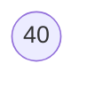

**Insert $20$:** Since $20 < 40$, it branches left

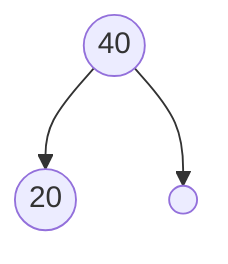

**Insert $60$:** Since $60 > 40$, it branches right

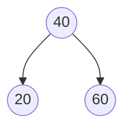

**Insert $10$**: Since $10 < 40$, it moves left to $20$. But, since $10 < 20, it branches left of $20$.

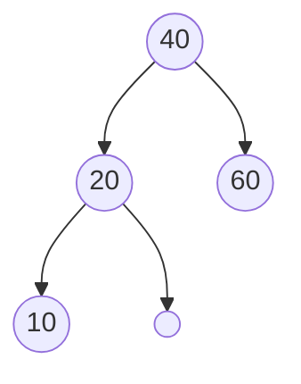

**Insert $30$**: Since $30 < 40$, it moves left to $20$. But, since $30 > 20$, it branches right of $20$.

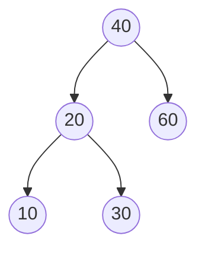

**Insert $50$ and $70$:** The last two numbers $50$ and $70$ go to the left and right of $60$ respectively.

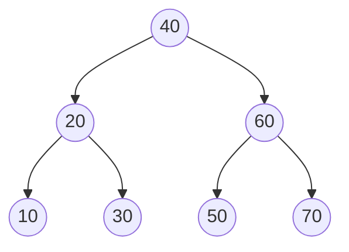

### Unbalanced Example

Now, consider the following sorted sequence, notably fewer than the first example.

$$
[10, 20, 30, 40]
$$

**Insert $10$**: Establishes the root node.

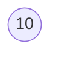

**Insert $20$**: Since $20 > 10$, it branches right of $10$.

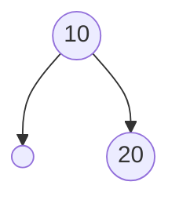

**Insert $30$:** Traversal begins at the root $10$. Since $30$ is greater than $10$, move to the right of $20$ instead. Checking against $20$, $30$ is also greater than $20$, so it is placed in the right.

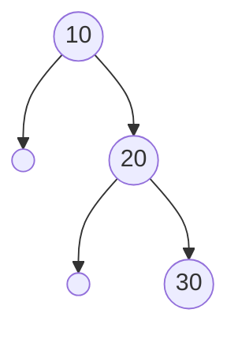

**Insert $40$:** The same thing applies. In fact, had the sequence continued, it would result in an even higher tree (since we called the highest level height).

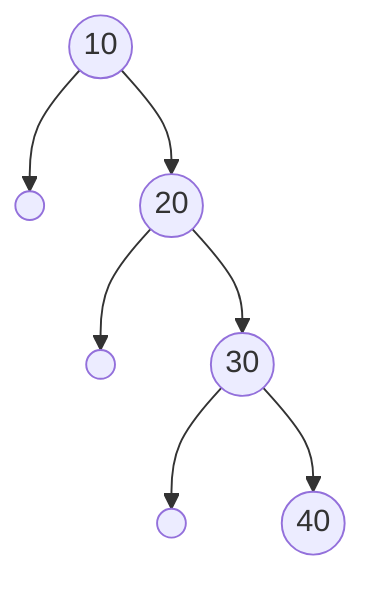

Inserting monotonically sorted input causes height expansion ($h = v - 1$). This is also true if the sequence was in decreasing order, with the only difference being the direction of the skewing. This will haunt us later.

### Searching Example

Consider searching for key $x = 30$ in the balanced BST:

$$
	[40, 20, 60, 10, 30, 50, 70]
$$


To search for target key $x = 30$, traversal follows four simple rules at each active node $\alpha$:

$$
\text{Rules at node } \alpha: \begin{cases} \alpha = \Lambda & \text{Search Failure} \\ x = \text{DATA}[\alpha] & \text{Search Success} \\ x < \text{DATA}[\alpha] & \text{Traverse } \text{LEFT}[\alpha] \\ x > \text{DATA}[\alpha] & \text{Traverse } \text{RIGHT}[\alpha] \end{cases}
$$

**Step 1**: Compare $x = 30$ at Root $40$. Since $30 < 40$, traverse left.

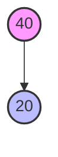

**Step 2**: Compare $x = 30$ at Node $20$. Since $30 > 20$, traverse right.

```mermaid
graph TD
    A2((20)) --> A5((30))
    style A2 fill:#f9f,stroke:#333,stroke-width:2px
    style A5 fill:#bbf,stroke:#333,stroke-width:2px
```

**Step 3**: Compare $x = 30$ at Node $30$. Match found ($30 = 30$).

> [!NOTE] Unfound Item
> When searching for an unindexed values (e.g., $x = 25$), traversal proceeds down to node $30$. The process evaluates $25 < 30$ and steps into $\text{LEFT}[30]$. Because $\text{LEFT}[30] = \Lambda$, reaching $\Lambda$ terminates the execution with a failure signal.

### Implementation

Rather than isolating tree search and insertion into distinct algorithmic structures, as generally approached defined in [2], this assessment utilizes a shared internal procedure, $BST\_DIVE$. This helper manages tree traversal and returns node reference $\omega$, indicating where traversal was last active.

```pseudo
\begin{algorithm}
\begin{algorithmic}
\Procedure{BST_DIVE}{$T, x$}
    \If{$T = \Lambda$}
        \State \Return $\Lambda$
    \EndIf

    \State $\omega \gets \Lambda$
    \State $\alpha \gets T$

    \While{$\alpha \neq \Lambda$}
        \If{$\text{DATA}[\alpha] = x$}
            \State \Return $\alpha$
        \EndIf
        \State $\omega \gets \alpha$
        \If{$x < \text{DATA}[\alpha]$}
            \State $\alpha \gets \text{LEFT}[\alpha]$
        \Else
            \State $\alpha \gets \text{RIGHT}[\alpha]$
        \EndIf
    \EndWhile

    \State \Return $\omega$
\EndProcedure
\end{algorithmic}
\end{algorithm}
```

There are three terminating cases to consider here:
- **Empty Tree ($T = \Lambda$)**: The loop body is skipped and the procedure returns $\Lambda$
- **Key Match ($x \in T$)**: The loop halts upon locating key $x$ and returns the matching node $\alpha$.
- **Key Absent ($x \notin T$)**: Pointer $\alpha$ steps into $\Lambda$ and returns pointer $\omega$ (the last non-null parent node traversed).

Now, when implementing $BST\_SEARCH$, if $BST\_DIVE$ returns $\Lambda$, then the search failed and $\Lambda$ is propagated. If not, the procedure returns if the pointer matches the data or not. The key difference between the two is that $BST\_DIVE$ may return $\omega$ which is not necessarily the item being searched for.

```pseudo
\begin{algorithm}
\begin{algorithmic}
\Procedure{BST_Search}{$T, x$}
\State $\alpha \gets$ \Call{BST_DIVE}{$T, x$}
\If{$\alpha \neq \Lambda \text{ and } \text{DATA}[\alpha] = x$}
    \State \Return $\alpha$
\EndIf
\State \Return $\Lambda$
\EndProcedure
\end{algorithmic}
\end{algorithm}
```

When implementing $BST\_INSERT$, retaining the assumption of unique values from earlier, then $BST\_DIVE$ will always return $\omega$ or $\Lambda$. Thus, the algorithm only needs to either propagate the $\Lambda$ value or connect the node $\ell$ to $\omega$.

```pseudo
\begin{algorithm}
\begin{algorithmic}
\Procedure{BST_Insert}{$T, \ell$}
\If{$T = \Lambda$}
    \State \Return $\ell$
\EndIf

\State $\omega \gets$ \Call{BST_DIVE}{$T, \text{DATA}[\ell]$}
\If{$\text{DATA}[\ell] = \text{DATA}[\omega]$}
    \State \Return $T$ \Comment{Duplicate found}
\ElsIf{$\text{DATA}[\ell] < \text{DATA}[\omega]$}
    \State $\text{LEFT}[\omega] \gets \ell$
\Else
    \State $\text{RIGHT}[\omega] \gets \ell$
\EndIf

\State \Return $T$
\EndProcedure
\end{algorithmic}
\end{algorithm}
```

### Algorithmic Analysis

By abstracting the tree traversal process into $BST\_DIVE$, both the search and insertion algorithms share the same asymptotic bottleneck. Because the higher-level wrapper procedures only append constant-time $O(1)$ operations, analyzing the time complexity of $BST\_DIVE$ dictates the runtime for both operations.

#### Best-Case Scenario

The optimal case occurs when $T = \Lambda$ or when the target key $x$ resides directly at the root node ($\alpha = T$). Here, the condition $\text{DATA}[T] = x$ evaluates to true on the initial check, bypassing the loop traversal entirely (or after a single iteration for insertion):

$$T_{\text{best}}(v, h) = O(1)$$

#### Balanced Tree Scenario

In a balanced binary tree, nodes are distributed evenly across left and right subtrees. The height $h$ is bounded logarithmically relative to the total node count $v$:

$$
h = \lfloor \lg v \rfloor
$$

At each iteration of the `while` loop, selecting a child node eliminates the opposing subtree from the search space, effectively halving the remaining candidate nodes. This halving repeats at each step down the path until $x$ is found or a null child is reached at depth $h + 1$. Consequently, the worst-case runtime for a balanced tree scales linearly with its height:

$$T(v, h) = O(h) = O(\lg v)$$

#### Skewed Tree Scenario

In a skewed binary tree where all nodes chain in a single direction, stepping down a level fails to eliminate a half-tree of candidates because the off-side subtrees are empty. If the target element lies at the deepest leaf or is absent from the tree, the traversal must inspect every node $v$ sequentially:

$$
	T(v, h) = O(v)
$$

This degrades the unbalanced binary tree search to match the performance of a linear search, but with the additional memory overhead of node pointers.

## References

1. E. P. Quiwa, *Data Structures*. Manila, Philippines: Office of the Vice-President for Academic Affairs, University of the Philippines System / Electronics Hobbyists Publishing House, 2007, Ch. 6 (ISBN: 971-897806-1).
2. E. P. Quiwa, *Data Structures*. Manila, Philippines: Office of the Vice-President for Academic Affairs, University of the Philippines System / Electronics Hobbyists Publishing House, 2007, Ch. 14 (ISBN: 971-897806-1).
