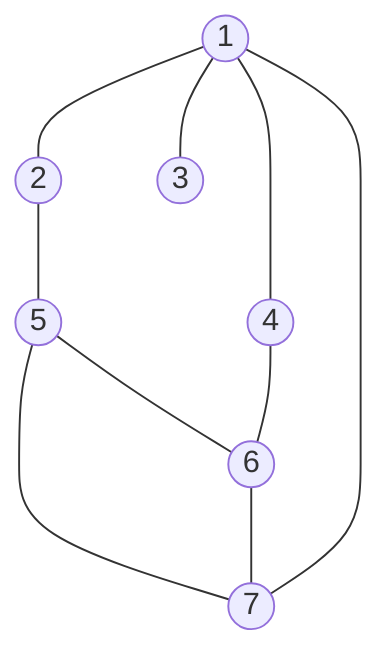

# CS 197 TZZQ - Assessment 07

Submitted by Stephen Sabas Singer on September 7, 2026

## Depth

> [!Info] Instruction
> Construct a depth-first forest for the undirected graph below. Indicate the discovery time and finishing time of each vertex and the type of each edge.



edges
(1,2)
(1,3)
(1,4)
(1,7)
(2,5)
(5,6)
(5,7)
(6,7)
(4,6)

Assume neighbors are explored in **ascending numerical order**.

Adjacency list:

1: 2,3,4,7
2: 1,5
3: 1
4: 1,6
5: 2,6,7
6: 4,5,7
7: 1,5,6

traverse: 1 -> 2 -> 5 -> 6 -> 4
backtrack: 4 -> 6
traverse: 6 -> 7
backtrack: 7-> 6 -> 5 -> 2 -> 1
traverse: 1 -> 3

discovery and finish times
1 (1,14)
2 (2,11)
3 (12,13)
4 (5,6)
5 (3,10)
6 (4,9)
7 (7,8)

tree edge
(1,2)
(2,5)
(5,6)
(6,4)
(6,7)
(1,3)

back edge
(1,4)
(1,7)
(5,7)

```
1  

├── 2  

│ └── 5  

│ └── 6  

│ ├── 4  

│ └── 7  

└── 3
```

1. a

Breadth-First Forest (BFS Tree)

(Assuming smallest-numbered neighbor first)


1

├── 2

│ └── 5

├── 3

├── 4

│ └── 6

└── 7


Levels of Each Vertex


Vertex Level

1 0

2 1

3 1

4 1

7 1

5 2

6 2


Edge Classification


Tree Edges

-----------

(1,2)

(1,3)

(1,4)

(1,7)

(2,5)

(4,6)


Non-Tree Edges

--------------

(5,6)

(5,7)

(6,7)


Explanation of Non-Tree Edges


(5,6) : connects two vertices already discovered at Level 2

(5,7) : connects Level 2 to Level 1

(6,7) : connects Level 2 to Level 1


Final Answer


BFS Forest:

```

1  

├── 2  

│ └── 5  

├── 3  

├── 4  

│ └── 6  

└── 7
```  

Levels:

1(0), 2(1), 3(1), 4(1), 7(1), 5(2), 6(2)


Tree Edges:

(1,2), (1,3), (1,4), (1,7), (2,5), (4,6)


Non-Tree Edges:

(5,6), (5,7), (6,7)
