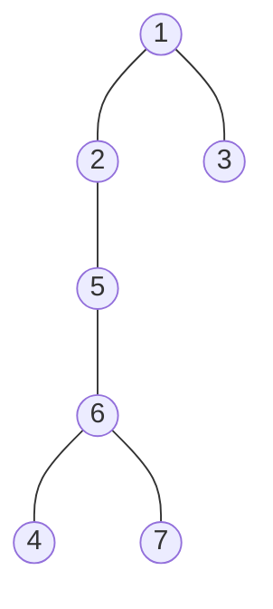
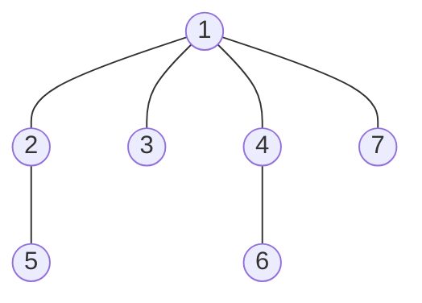
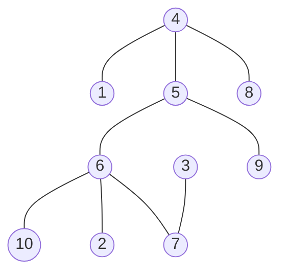
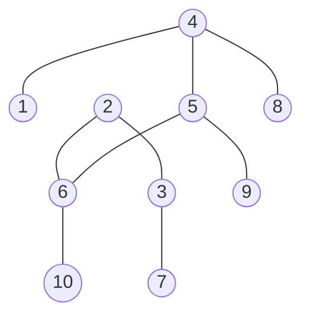

# CS 197 TZZQ - Assessment 07

Submitted by Stephen Sabas Singer on September 17, 2026

## Graph Traversal

### Description

This assessment provides the following graph for the first two items:

![[CS 197 HZZQ - Assessment 07 - Graph 1.png]]

This graph has the following edges $e$:

- $(1, 2)$
- $(1, 3)$
- $(1, 4)$
- $(1, 7)$
- $(2, 5)$
- $(5, 6)$
- $(6, 7)$
- $(4, 6)$

This graph has the following adjacency list:
| Vertex | Adjacent Vertices |

| Vertex | Adjacent Vertices |
| ------ | ----------------- |
| 1      | 2, 3, 4, 7        |
| 2      | 1, 5              |
| 3      | 1                 |
| 4      | 1, 6              |
| 5      | 2, 6, 7           |
| 6      | 4, 5, 7           |
| 7      | 1, 5, 6           |

### Depth-First Traversal

> [!example] Instruction
> Construct a depth-first forest for the undirected graph below. Indicate the discovery time and finishing time of each vertex and the type of each edge.

> [!NOTE] Neighbor Exploration
> Assume neighbors are explored in ascending numerical order

Here is the step-by-step depth-first traversal of the given graph.

|  Time  | Event     | Vertex | Traversed / Backtracked Via                          | Active Call Stack |
| :----: | :-------- | :----: | :--------------------------------------------------- | :---------------- |
| **1**  | Discover  |   1    | Initial Root Start                                   | [1]               |
| **2**  | Discover  |   2    | Tree Edge (1, 2)                                     | [1, 2]            |
| **3**  | Discover  |   5    | Tree Edge (2, 5)                                     | [1, 2, 5]         |
| **4**  | Discover  |   6    | Tree Edge (5, 6)                                     | [1, 2, 5, 6]      |
| **5**  | Discover  |   4    | Tree Edge (6, 4) *(Back edge (1,4) checked)*         | [1, 2, 5, 6, 4]   |
| **6**  | Backtrack |   4    | Finished (Backtrack to 6)                            | [1, 2, 5, 6]      |
| **7**  | Discover  |   7    | Tree Edge (6, 7) *(Back edges (1,7), (5,7) checked)* | [1, 2, 5, 6, 7]   |
| **8**  | Backtrack |   7    | Finished (Backtrack to 6)                            | [1, 2, 5, 6]      |
| **9**  | Backtrack |   6    | Finished (Backtrack to 5)                            | [1, 2, 5]         |
| **10** | Backtrack |   5    | Finished (Backtrack to 2)                            | [1, 2]            |
| **11** | Backtrack |   2    | Finished (Backtrack to 1)                            | [1]               |
| **12** | Discover  |   3    | Tree Edge (1, 3)                                     | [1, 3]            |
| **13** | Backtrack |   3    | Finished (Backtrack to 1)                            | [1]               |
| **14** | Backtrack |   1    | Finished (Root DFS Complete)                         | []                |

This traversal process constructs the following depth-first forest.

In summary, here are the discovery time, finishing time, outgoing tree edges, and outgoing back edges for reference.

| Vertex | Discovery ($d$) | Finish ($f$) | Outgoing Tree Edges | Outgoing Back Edges |
| :----: | :-------------: | :----------: | :------------------ | :------------------ |
|   1    |        1        |      14      | (1, 2), (1, 3)      |                     |
|   2    |        2        |      11      | (2, 5)              |                     |
|   3    |       12        |      13      |                     |                     |
|   4    |        5        |      6       |                     | (4, 1)              |
|   5    |        3        |      10      | (5, 6)              |                     |
|   6    |        4        |      9       | (6, 4), (6, 7)      |                     |
|   7    |        7        |      8       |                     | (7, 1), (7, 5)      |

### Breadth-First Traversal

> [!example] Instruction
> Construct a breadth-first forest for the undirected graph in previous item. Indicate the level of each vertex and the type of each edge in the graph.

> [!NOTE] Neighbor Exploration
> Assume neighbors are explored in ascending numerical order, and traversal adheres to queue resolution

|**Time**|**Event**|**Active Vertex**|**Traversed / Checked Via**|**Active Queue**|
|---|---|---|---|---|
|1|Discover|1|Initial Root Start|[1]|
|2|Discover|2|Tree Edge (1, 2)|[1, 2]|
|3|Discover|3|Tree Edge (1, 3)|[1, 2, 3]|
|4|Discover|4|Tree Edge (1, 4)|[1, 2, 3, 4]|
|5|Discover|7|Tree Edge (1, 7)|[1, 2, 3, 4, 7]|
|6|Finish|1|Processed all neighbors|[2, 3, 4, 7]|
|7|Discover|5|Tree Edge (2, 5)|[2, 3, 4, 7, 5]|
|8|Finish|2|Processed all neighbors|[3, 4, 7, 5]|
|9|Finish|3|Processed all neighbors|[4, 7, 5]|
|10|Discover|6|Tree Edge (4, 6)|[4, 7, 5, 6]|
|11|Finish|4|Processed all neighbors|[7, 5, 6]|
|12|Finish|7|Non-Tree Edges (7, 5), (7, 6) checked|[5, 6]|
|13|Finish|5|Non-Tree Edge (5, 6) checked|[6]|
|14|Finish|6|Processed all neighbors|[]|

This traversal process constructs the following breadth-first forest.

Note the following levels of the provided vertices.

| Vertex | Level |
| ------ | ----- |
| 1      | 0     |
| 2      | 1     |
| 3      | 1     |
| 4      | 1     |
| 7      | 1     |
| 5      | 2     |
| 6      | 2     |

In summary, here are the discovery time, finishing time, outgoing tree edges, and outgoing back edges for reference.

| Vertex | Level | Discovery | Finish | Outgoing Tree Edges        | Outgoing Non-Tree |
| ------ | ----- | --------- | ------ | -------------------------- | ----------------- |
| 1      | 0     | 1         | 6      | (1,2), (1,3), (1,4), (1,7) |                   |
| 2      | 1     | 2         | 8      | (2, 5)                     |                   |
| 3      | 1     | 3         | 9      |                            |                   |
| 4      | 1     | 4         | 11     | (4, 6)                     |                   |
| 5      | 2     | 7         | 13     |                            | (5, 6)            |
| 6      | 2     | 10        | 14     |                            |                   |
| 7      | 1     | 5         | 12     |                            | (7, 5), (7, 6)    |

## Minimum Cost Spanning Tree

### Description

This assessment provides the following graph for the third and fourth item:
![[Pasted image 20260916145008.png]]

### Prim's Algorithm

> [!example] Instruction
> Find a minimum cost spanning tree for the graph shown below using Prim's algorithm.

| Step | Selected | Visited Vertices                                                                                                                                                                                                                                                                                                                  | Edges  | Available Edges                                                                                                                                                                                                                                                                                                                                                                                                                                                                                                                                                                                                                                                                    |
| :--: | :------: | :-------------------------------------------------------------------------------------------------------------------------------------------------------------------------------------------------------------------------------------------------------------------------------------------------------------------------------- | ------ | :--------------------------------------------------------------------------------------------------------------------------------------------------------------------------------------------------------------------------------------------------------------------------------------------------------------------------------------------------------------------------------------------------------------------------------------------------------------------------------------------------------------------------------------------------------------------------------------------------------------------------------------------------------------------------------- |
|  0   |          | {4}                                                                                                                                                                                                                                                                                                  |        | 15, 17, 19                                                                                                                                                                                                                                                                                                                                                                                                                                                                                                                                                                                  |
|  1   |    15    | {4, 5}                                                                                                                                                                                                                                                                  | (4,5)  | 15, 17, 19, 23, 28, 29, 34, 40                                                                                                                                                                                                                                                                                                                                                                                                             |
|  2   |    17    | {4, 5, 8}                                                                                                                                                                                                                                  | (4,8)  | 15, 17, 19, 23, 28, 29, 29, 34, 35, 40                                                                                                                                                                                                                                                                                                                                           |
|  3   |    19    | {4, 5, 8, 1}                                                                                                                                                                                                  | (4,1)  | 15, 17, 19, 23, 28, 29, 29, 30, 34, 35, 40                                                                                                                                                                                                                                                                                                          |
|  4   |    28    | {4, 5, 8, 1, 6}                                                                                                                                                                  | (5,6)  | 15, 17, 19, 21, 23, 25, 26, 28, 29, 29, 30, 31, 34, 35, 35, 40                                                                                                                                     |
|  5   |    21    | {4, 5, 8, 1, 6, 10}                                                                                                                                 | (6,10) | 15, 17, 19, 21, 23, 25, 26, 28, 29, 29, 30, 31, 32, 34, 35, 35, 40, 40                                                                   |
|  6   |    25    | {4, 5, 8, 1, 6, 10, 2}                                                                                                 | (6,2)  | 15, 17, 19, 21, 23, 25, 26, 26, 28, 29, 29, 30, 31, 32, 34, 35, 35, 40, 40                                  |
|  7   |    26    | {4, 5, 8, 1, 6, 10, 2, 7}                                                                 | (6,7)  | 15, 17, 17, 19, 21, 23, 25, 26, 26, 28, 29, 29, 30, 31, 32, 34, 35, 35, 40, 40 |
|  8   |    17    | {4, 5, 8, 1, 6, 10, 2, 7, 3}                                 | (3,7)  | 15, 17, 17, 19, 21, 23, 25, 26, 26, 28, 29, 29, 30, 31, 32, 34, 35, 35, 40, 40 |
|  9   |    34    | {4, 5, 8, 1, 6, 10, 2, 7, 3, 9} | (5,9)  | 15, 17, 17, 19, 21, 23, 25, 26, 26, 28, 29, 29, 30, 31, 32, 34, 35, 35, 40, 40 |

This application of the algorithm results in the following Minimum Spanning Tree:

Which has the following minimum cost:

$$
\begin{align}
+15 + 17 + 19  \\
+ 28 + 21 + 25  \\
+ 26 + 17 + 34  \\
= \mathbf{202}
\end{align}
$$

### Kruskal's Algorithm

> [!example] Instruction
> Find a minimum cost spanning tree for the graph in Item 3 using Kruskal's algorithm.

| Step | Selected | Edge      | Visited Vertices                     |
| ---- | -------- | --------- | ------------------------------------ |
| 1    | 15       | $(4, 5)$  | {**4, 5**}                           |
| 2    | 17       | $(4, 8)$  | {4, 5, **8**}                        |
| 3    | 17       | $(3, 7)$  | {4, 5, 8}, **{3, 7}**                |
| 4    | 19       | $(4, 1)$  | {4, 5, 8, **1**}, {3, 7}             |
| 5    | 21       | $(6, 10)$ | {4, 5, 8, 1}, {3, 7}, **{6, 10}**    |
| 6    | 25       | $(2, 6)$  | {4, 5, 8, 1}, {3, 7}, {**2**, 6, 10} |
| 7    | 26       | $(2, 3)$  | {4, 5, 8, 1}, {2, 3, 6, 7, 10}       |
| 8    | 28       | $(5, 6)$  | {1, 2, 3, 4, 5, 6, 7, 8, 10}         |
| 9    | 34       | $(9, 5)$  | {1, 2, 3, 4, 5, 6, 7, 8, **9**, 10}  |

This application of the algorithm results in the following Minimum Spanning Tree:

Which has the following minimum cost, same as the previous subsection:

$$
\begin{align}
+15 + 17 + 17  \\
+ 19 + 21 + 25  \\
+ 26 + 28 + 34  \\
= \mathbf{202}
\end{align}
$$

## Single-Source Shortest Path

> [!example] Instructions
> Solve the single-source shortest path (SSSP) problem with vertex 1 as the source vertex for the graph shown below using Dijkstra's algorithm.

![[CS 197 HZZQ - Assessment 07 - Graph 3.png]]

For this item, the steps will be done one stack pop at a time. Assume nodes will be processed from minimum cost to maximum cost.

In initial state, $\mathbb{Q}= [1]$

| Node | Cost | Previous |
| :--- | :--- | :------- |
| 1    | 0    |          |
| 2    |      |          |
| 3    |      |          |
| 4    |      |          |
| 5    |      |          |
| 6    |      |          |
| 7    |      |          |
| 8    |      |          |

For Step 1, $\mathbb{Q}= [3, 2]$, pop $1$.

| Node | Cost | Previous |
| :--- | :--- | :------- |
| 1    | 0    |          |
| 2    | 80   | 1        |
| 3    | 40   | 1        |
| 4    |      |          |
| 5    |      |          |
| 6    |      |          |
| 7    |      |          |
| 8    |      |          |

For Step 2, $\mathbb{Q}= [4, 2, 2^{*}, 5]$, pop $3$.

> [!NOTE] Update
> Updated Node $2$ cost from 80 to 70 via Node 3 (cheaper entry $2$ placed ahead of stale $2^{*}$)

| Node | Cost | Previous |
| :--- | :--- | :------- |
| 1    | 0    |          |
| 2    | 70   | 3        |
| 3    | 40   | 1        |
| 4    | 50   | 3        |
| 5    | 120  | 3        |
| 6    |      |          |
| 7    |      |          |
| 8    |      |          |

For Step 3, $\mathbb{Q}= [2, 7, 2^{*}, 6, 5]$, pop $4$.

| Node | Cost | Previous |
| :--- | :--- | :------- |
| 1    | 0    |          |
| 2    | 70   | 3        |
| 3    | 40   | 1        |
| 4    | 50   | 3        |
| 5    | 120  | 3        |
| 6    | 90   | 4        |
| 7    | 70   | 4        |
| 8    |      |          |

For Step 4, $\mathbb{Q}= [7, 2^{*}, 6, 5, 8]$, pop $2$.

| Node | Cost | Previous |
| :--- | :--- | :------- |
| 1    | 0    |          |
| 2    | 70   | 3        |
| 3    | 40   | 1        |
| 4    | 50   | 3        |
| 5    | 120  | 3        |
| 6    | 90   | 4        |
| 7    | 70   | 4        |
| 8    | 120  | 2        |

For Step 5, $\mathbb{Q}= [2^{*}, 6, 6^{*}, 5, 5^{*}, 8]$, pop $7$.

> [!NOTE] Update
> Updated Node 5 cost from 120 to 110 via Node 7 (add entry $5$ ahead of $5^{*}$). Updated Node 6 cost from 90 to 80 via Node 7 (add entry $6$ ahead of $6^{*}$)

| Node | Cost | Previous |
| :--- | :--- | :------- |
| 1    | 0    |          |
| 2    | 70   | 3        |
| 3    | 40   | 1        |
| 4    | 50   | 3        |
| 5    | 110  | 7        |
| 6    | 80   | 7        |
| 7    | 70   | 4        |
| 8    | 120  | 2        |

For Step 6, $\mathbb{Q}= [6, 6^{*}, 5, 5^{*}, 8]$, pop $2^{*}$ (Outdated entry, skipped).

| Node | Cost | Previous |
| :--- | :--- | :------- |
| 1    | 0    |          |
| 2    | 70   | 3        |
| 3    | 40   | 1        |
| 4    | 50   | 3        |
| 5    | 110  | 7        |
| 6    | 80   | 7        |
| 7    | 70   | 4        |
| 8    | 120  | 2        |

For Step 7, $\mathbb{Q}= [6^{*}, 5, 5^{*}, 8]$, pop $6$.

| Node | Cost | Previous |
| :--- | :--- | :------- |
| 1    | 0    |          |
| 2    | 70   | 3        |
| 3    | 40   | 1        |
| 4    | 50   | 3        |
| 5    | 110  | 7        |
| 6    | 80   | 7        |
| 7    | 70   | 4        |
| 8    | 120  | 2        |

For Step 8, $\mathbb{Q}= [5, 5^{*}, 8]$, pop $6^{*}$ (Outdated entry, skipped).

| Node | Cost | Previous |
| :--- | :--- | :------- |
| 1    | 0    |          |
| 2    | 70   | 3        |
| 3    | 40   | 1        |
| 4    | 50   | 3        |
| 5    | 110  | 7        |
| 6    | 80   | 7        |
| 7    | 70   | 4        |
| 8    | 120  | 2        |

For Step 9, $\mathbb{Q}= [5^{*}, 8]$, pop $5$.

| Node | Cost | Previous |
| :--- | :--- | :------- |
| 1    | 0    |          |
| 2    | 70   | 3        |
| 3    | 40   | 1        |
| 4    | 50   | 3        |
| 5    | 110  | 7        |
| 6    | 80   | 7        |
| 7    | 70   | 4        |
| 8    | 120  | 2        |

For Step 10, $\mathbb{Q}= [8]$, pop $5^{*}$ (Outdated entry, skipped).

| Node | Cost | Previous |
| :--- | :--- | :------- |
| 1    | 0    |          |
| 2    | 70   | 3        |
| 3    | 40   | 1        |
| 4    | 50   | 3        |
| 5    | 110  | 7        |
| 6    | 80   | 7        |
| 7    | 70   | 4        |
| 8    | 120  | 2        |

Finally, for Step 11, $\mathbb{Q}= []$ (Empty), pop $8$.

| Node | Cost | Previous |
| :--- | :--- | :------- |
| 1    | 0    |          |
| 2    | 70   | 3        |
| 3    | 40   | 1        |
| 4    | 50   | 3        |
| 5    | 110  | 7        |
| 6    | 80   | 7        |
| 7    | 70   | 4        |
| 8    | 120  | 2        |

## All-Pairs Shortest Path

> [!example] Instructions
> Solve the APSP problem for the graph shown below using Floyd's algorithm.

![[CS 197 HZZQ - Assessment 07 - Graph 4.png]]

The given graph can be represented using the following adjacency matrix.

$$
	
\begin{array}{c|cccc}
 & 1 & 2 & 3 & 4 \\
\hline
1 & 0 & 1 & 3 & 5 \\
2 & 2 & 0 & \infty & 2 \\
3 & 4 & \infty & 0 & 6 \\
4 & 6 & 3 & 7 & 0
\end{array}
$$

With the given algorithm, multiple intermediate vertex $k$ choices will be tested to see if the path reduces the total distance between any two adjacent vertices $i, j$.

At $k = 0$, the initial matrix $D^{(0)}$ represents the direct edge weights between vertices. No intermediate vertices are allowed yet. If there is no direct edge, the distance is $\infty$.

$$
	D^{(0)} = 
\begin{pmatrix}
0 & 1 & 3 & 5 \\
2 & 0 & \infty & 2 \\
4 & \infty & 0 & 6 \\
6 & 3 & 7 & 0
\end{pmatrix}
$$

At $k=1$, the first row and column of $D^{(0)}$ is tested to see if routing through $v_{1}$ reduces any path lengths.

$$
	\begin{align*}
    D^{(1)}[2, 3] &= \min\left(D^{(0)}[2, 3], D^{(0)}[2, 1] + D^{(0)}[1, 3]\right) \\
    &= \min(\infty, 2 + 3) \\
    &= 5 \\
    D^{(1)}[3, 2] &= \min\left(D^{(0)}[3, 2], D^{(0)}[3, 1] + D^{(0)}[1, 2]\right) \\
    &= \min(\infty, 4 + 1) \\
    &= 5
\end{align*}

$$

$$
	D^{(1)} = 
\begin{pmatrix}
0 & 1 & 3 & 5 \\
2 & 0 & \mathbf{5} & 2 \\
4 & \mathbf{5} & 0 & 6 \\
6 & 3 & 7 & 0
\end{pmatrix}
$$

At $k=2$, the second row and column of $D^{(1)}$ is tested to see if routing through $v_{2}$ reduces any path lengths.

$$
	\begin{align*} 
    D^{(2)}[1, 4] &= \min\left(D^{(1)}[1, 4], D^{(1)}[1, 2] + D^{(1)}[2, 4]\right) \\
    &= \min(5, 1 + 2) \\
    &= 3 \\
    D^{(2)}[4, 1] &= \min\left(D^{(1)}[4, 1], D^{(1)}[4, 2] + D^{(1)}[2, 1]\right) \\
    &= \min(6, 3 + 2) \\
    &= 5
\end{align*}
$$

$$
	D^{(2)} = 
\begin{pmatrix}
0 & 1 & 3 & \mathbf{3} \\
2 & 0 & 5 & 2 \\
4 & 5 & 0 & 6 \\
\mathbf{5} & 3 & 7 & 0
\end{pmatrix}
$$

At $k=3$, the third row and column of $D^{(2)}$ is tested to see if routing through $v_{3}$ reduces any path lengths.

$$

\begin{align*}
    D^{(3)}[1, 2] &= \min\left(D^{(2)}[1, 2], D^{(2)}[1, 3] + D^{(2)}[3, 2]\right) \\
    &= \min(1, 3 + 5) \\
    &= 1 \\
    D^{(3)}[2, 4] &= \min\left(D^{(2)}[2, 4], D^{(2)}[2, 3] + D^{(2)}[3, 4]\right) \\
    &= \min(2, 5 + 6) \\
    &= 2 \\
    D^{(3)}[4, 1] &= \min\left(D^{(2)}[4, 1], D^{(2)}[4, 3] + D^{(2)}[3, 1]\right) \\
    &= \min(5, 7 + 4) \\
    &= 5 
\end{align*}	
$$

None of the combinations through $v_{3}$ yield a shorter path than what is already recorded. Therefore, the matrix does not change.

$$
	D^{(3)} = D^{(2)} = 
\begin{pmatrix} 
0 & 1 & 3 & 3 \\ 
2 & 0 & 5 & 2 \\ 
4 & 5 & 0 & 6 \\ 
5 & 3 & 7 & 0 
\end{pmatrix}
$$

Finally, at $k=4$, the fourth row and column of $D^{(3)}$ is tested to evaluate routing through $v_{4}$.

$$
	\begin{align*}
    D^{(4)}[2, 3] &= \min\left(D^{(3)}[2, 3], D^{(3)}[2, 4] + D^{(3)}[4, 3]\right) \\
    &= \min(5, 2 + 7) \\
    &= 5 \\
    D^{(4)}[3, 2] &= \min\left(D^{(3)}[3, 2], D^{(3)}[3, 4] + D^{(3)}[4, 2]\right) \\
    &= \min(5, 6 + 3) \\
    &= 5
\end{align*}
$$

Routing through $v_{4}$ does not improve any existing paths.

$$
	
D^{(4)} = D^{(3)} = 
\begin{pmatrix}
0 & 1 & 3 & 3 \\
2 & 0 & 5 & 2 \\
4 & 5 & 0 & 6 \\
5 & 3 & 7 & 0
\end{pmatrix}
$$

The final matrix $D^{(4)}$ contains the shortest distance between every pair of vertices in the graph.
