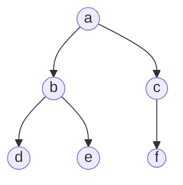

# CS 197 TZZQ - Assessment 04

Submitted by Stephen Sabas Singer on September 6, 2026

> [!NOTE] Instructions
> Please submit a written report on some application of stacks, queues and linear lists. The report is expected to provide at least one application per abstract data type. Per application, describe the algorithms for which these ADTs are used and illustrate their usage with examples. Finally, evaluate the running time and time complexity of the algorithms described. Please include a list of references you consulted for the report.

## Stacks

One of the most well known applications of the stack is the Depth-First Search (DFS) Algorithm.

### Depth-First Search

#### Introduction

The Depth-First Search Algorithm is one of the two primary graph traversal algorithms, as noted in [1] and [2].

As the name suggests, it tends to search deeper in the levels of a graph (vertical) as opposed to exhausting a node's neighbors (horizontal). Given a node or vertex $v^{0}$, it goes through its neighboring vertex $v^{1}$ and goes through the neighboring vertex of that $v^{2}$, until the maximum level is reached $v^{d-1}$. It then backtracks to the previous level $v^{d-2}$ and checks the other unexplored vertices and applies the same rule. [3]

Below is an excerpt from the main reference of the course [2]

> [!NOTE] Data Structures (Chapter 9) by Quiwa
> In DFS of a graph $G = (V, E)$ the search begins from some start vertex, say $s$, which is the first vertex to be discovered. Subsequently, an edge incident from $s$ is explored to discover another vertex. The search then continues by exploring, each time, an edge incident from the most recently discovered vertex; thus the search proceeds farther and farther from the start vertex and 'deeper' into the graph. If all the edges leaving the most recently discovered vertex, say $j$, are found to have been already explored (i.e., the search has reached a 'dead end'), then DFS backtracks to the vertex, say $i$, from which $j$ was discovered, and explores an edge leaving i to discover another vertex, if any. This process of searching in the deeper direction, backtracking when a dead end is reached, then searching deeper into the graph again, continues until all vertices reachable from the start vertex $s$ are discovered. The search started from $s$ terminates after DFS backtracks all the way back to $s$ and finds all edges incident from $s$ already explored. If there are still undiscovered vertices after the search initiated from $s$ terminates, then a new search is started from any one of these undiscovered vertices. This entire process is repeated until all vertices in $G$ are discovered.

#### General Application

This concept, like most graph algorithms, is easier understood visually. Consider the following binary tree as an example of a graph.



The intent is focus on going down levels (vertical) rather than exploring same level nodes (horizontal). Thus, the goal is to have the following sequence first.

$$
	a \to b \to d
$$

A breadth-first approach might pick up $c$ immediately in this step. More on this in the next section (given it uses queues).

$$
a \to b \to c 
$$

After reaching $d$, the maximum depth has been reach since $d$ has no children and this is one of the longest paths. So the next step is to backtrack to $b$.

$$
	a \to b \to d
$$

The node $b$ has already been traversed but it does have one more children $e$ that can be traversed. Rather than backtracking to $a$, maximizing depth dictates the next item should be $e$

$$
	a \to b \to d \to e
$$

After this, all the nodes on the left side of $a$ are traversed. With successive backtracking, the algorithm traverses back $e \to b \to a$.

Similar to the case in$f$, $c$ is untraversed as a child of $a$.

$$
	a \to b \to d \to e \to c
$$

The node $c$ only has one children $f$. With this, all the nodes are complete. Depending on the implementation, a implicit step of backtracking back to $a$ is required to fully determine the algorithm's end.

$$
	a \to b \to d \to e \to c \to f
$$

The direction matters because if opted to go right-left instead, the output would be the following:

$$
	a \to c \to f \to b \to e \to d
$$

The algorithm can be described in the following steps:
1. Select the starting node, mark it as visited, and process it.
2. Move to an unvisited neighbor and process it immediately to continue moving deeper down the branch.
3. Track unexplored alternative paths at each step so they can be revisited.
4. Backtrack to the most recently discovered alternative whenever a dead end is reached, repeating the deep-first search from there.

#### Stack Implementation

The nature of DFS lends itself well to a natural recursive implementation (which will be briefly discussed in the next section). However, it can also be implemented using an explicit stack $\mathbb{S}$, as explained in [1].

With this approach, every new node traversed is added to the stack. The algorithm still follows the same concept.

1. **Initialization:** Mark root node as visited and push it to the stack $\mathbb{S}$.
2. **Main Process:** While $\mathbb{S}$ is not empty:
    - Pop the top node and process it.
    - Push its unvisited neighbors to $\mathbb{S}$ in **reverse order** of desired traversal

In pseudo code, this would be implemented as the following. This is a generalization of the design in [1] and [2], with the visitation tracked using a separate set to generalize the process and the time tracking removed to focus purely on traversal. Marking nodes as visited upon pushing prevents duplicate pushes and potential infinite loops in cyclical graphs.

```pseudo
\begin{algorithm}
\begin{algorithmic}
\Procedure{DFS}{root}
    \If{root = $\Lambda$}
        \State \Return
    \EndIf

    \State $\text{Visited} \gets \{\text{root}\}$
    \State $\mathbb{S} \gets$ \Call{INIT_EMPTY_STACK}{}
    \State \Call{Push}{$\mathbb{S}$, root}

    \While{\Call{NOT}{\Call{IS_EMPTY_STACK}{$\mathbb{S}$}}}
        \State $v \gets$ \Call{POP}{$\mathbb{S}$}
        \State \Call{PROCESS}{$v$}

        \For{each child $u$ of $v$ (in reverse order)}
            \If{$u \notin \text{Visited}$}
                \State $\text{Visited} \gets \text{Visited} \cup \{u\}$
                \State \Call{PUSH}{$\mathbb{S}$, $u$}
            \EndIf
        \EndFor
    \EndWhile
\EndProcedure
\end{algorithmic}
\end{algorithm}
```

If the graph is a directed tree and has no cycles, then checking whether a node has been visited is unnecessary. This is because if there is only one path for a given node, then there would not be a way to traverse it more than once. Thus, once processed, it should not be seen again nor processed again .

In pseudocode for a directed tree, the algorithm simplifies to:

```pseudo
\begin{algorithm} 
\begin{algorithmic} 
	\Procedure{DFS}{$root$} 
		\If{$root = \Lambda$} 
			\Return 
		\EndIf 
		
		\State $\mathbb{S} \gets$ \Call{INIT_EMPTY_STACK}{}
		\State \Call{Push}{$\mathbb{S}, root$}
		
		\While{\Call{Not}{\Call{IS_EMPTY_STACK}{$\mathbb{S}$}}}
			\State $v \gets$ \Call{Pop}{$\mathbb{S}$}
			\State \Call{Process}{$v$}
			\For{each child $u$ of $v$ (in reverse order)}
				\State \Call{Push}{$\mathbb{S}, u$}
			\EndFor
		\EndWhile
	\EndProcedure 
\end{algorithmic}
\end{algorithm}
```

Consider the same example from earlier and assume stack $\mathbb{S}$ is designed such that the rightmost component is the top.


Add the first node $a$ to the stack $\mathbb{S}$.

$$
	\mathbb{S}  = [a]
$$

Process and pop $a$. Then, push its children $c$, then $b$. Because a stack operates on a Last-In, First-Out (LIFO) basis, pushing $c$ first and $b$ second places $b$ at the top of the stack, ensuring $b$ is processed next to maintain left-to-right traversal.

$$
	\mathbb{S} = [c, b]
$$

Since the stack is not empty yet, process $b$. Then, add its children $d, e$ (again, in reverse order of intent).

$$
	\mathbb{S} = [c, e, d]
$$

Both $e, d$ do not have children so processing them reduces the overall size of the stack until it reaches this point.

$$
\mathbb{S} = [c]
$$

The node $c$ only has one children. Processing it and doing the traversal leads to this state.

$$
\mathbb{S} = [f]
$$

And one final application of the algorithm for $f$, the graph is fully traversed and the algorithm stops since the stack is empty.

$$
\mathbb{S} = []
$$

Noting the order of when the nodes are popped, the sequence of traversal is the following:

$$
	a \to b \to d \to e \to c \to f
$$

The reverse direction of stack pushing is intentional. Had the direction been the opposite, the sequence would be the following. The same principle was observed earlier too.

$$
	a \to c \to f \to b \to e \to d
$$

Since you switched to marking nodes as visited **on push** rather than **on pop**, every unvisited vertex is inserted into `Visited` and pushed to the stack **at most once**.

#### Algorithm Analysis

Analyzing the iterative approach, the algorithm employs $O(1)$ stack operations (assuming linked list implementation), set operations with $\text{Visited}$, and an edge-traversal `for` loop nested within the primary `while` loop.

Let $V$ denote the set of vertices (or nodes) with total cardinality $\vert{}V\vert{}$, and $E$ denote the set of edges or connections with total cardinality $\vert{}E\vert{}$. Additionally, let $P = f_P(v)$ represent the processing time for a vertex $v$, $T = f_T(v)$ denote the time required for a set membership lookup ($v \in \text{Visited}$), and $I = f_I(v)$ denote the time required to insert a vertex into $\text{Visited}$.

Because nodes are marked as visited upon PUSH rather than POP, a vertex $u$ is inserted into $\text{Visited}$ and pushed to stack $\mathbb{S}$ at most once. This bounds the total number of push and pop operations strictly by $O(\vert{}V\vert{})$.

Each popped vertex is processed exactly once, contributing $O(\vert{}V\vert{} \cdot P)$ to total processing time. The inner loop checks set membership ($u \notin \text{Visited}$) for every edge incident to a unique processed vertex. Summing across all unique vertices, this inner loop evaluates over every edge in the graph at most once, resulting in $O(\vert{}E\vert{})$ total set membership queries $f_T$ and $O(\vert{}V\vert{})$ total set insertions $f_I$. Combining these operations, the cumulative time complexity for this push-marked iterative DFS is the following:

$$
O(\vert{}V\vert{} \cdot P + \vert{}E\vert{} \cdot T + \vert{}V\vert{} \cdot I)
$$

Assuming standard O(1) hash set lookup (T) and insertion (I), alongside O(1) per-node processing (P), this simplifies to the following, as noted in [4].

$$
	O(\lvert V \rvert + \lvert E \rvert)
$$

Given the nature of a directed tree, the number of nodes is equal to the number of edges + 1. Visually, each node has its own incoming edge, except the root node which naturally has zero incoming edges. A single node is a tree by definition (a trivial tree), having 1 node and 0 edges.

Using $\lvert V \rvert - 1 = \lvert E \rvert$, the worst-case time complexity for a directed tree would be the following:

$$
	O(\lvert V \rvert + \lvert V \rvert - 1 ) = O(\lvert V \rvert)
$$

### Call Stack

Specifically referred in [1], the DFS algorithm can be implemented using recursion. However, this is possible because the system running the algorithm relies on an internal stack to track active recursive function calls, as explained in [5].

And speaking of Call Stack, as the name suggests, this is a data structure necessary for the implementation of operating systems.

But even outside the hardware perspective, backtracking requires remembering nodes in a Last-In, First-Out (LIFO) ruleset to maintain a depth-first traversal order.

## Queues

One key application of queues is the Breadth-First Search (BFS) Algorith, parallel to the Stack for DFS.

### Breadth-First Search

#### Introduction

The Breadth-First Search Algorithm is the second of the two primary graph traversal algorithms, also noted in [1] and [2].

As the name suggests, it tends to search across accessible, neighboring nodes from all the edges of the root node.

Below is an excerpt from the main reference of the course [6]

> [!NOTE] Data Structures (Chapter 9) by Quiwa
> In BFS of a graph $G = (V, E)$ the search begins from some start vertex, say $s$, which is the first vertex to be discovered. Subsequently, every edge incident from $s$ is explored to discover all the vertices adjacent to $s$, i.e., vertices that are one edge away from $s$. The search then continues by exploring edges incident from these latter vertices to discover, this time, all the vertices that are two edges away from $s$. Thus the search moves steadily forward across a wide front discovering vertices that are l edges away from $s$ before discovering vertices that are l + 1 edges away from $s$, until all vertices reachable from $s$ are discovered.

And as noted in [2] as well, this algorithm does not need backtracking.

#### General Application

Similar to DFS, this is easier understood visually. Consider the following binary tree as an example of a graph.


The intent is focus on going across nodes within levels (horizontal). Thus, the goal is to have the following sequence first. Essentially, all the children of $a$ is explored.

$$
	a \to b \to c
$$

After reaching the last children or neighbor of $a$, the next step is to move the next level. Depending on the direction, this can either be exploring the children of $b$ first (if left to right) or exploring $c$ first if right to left.

Assume left to right for this example.

$$
	a \to b \to c \to d \to e
$$

Then, with $d$ and $e$ having no children, $c$ is still due for a deeper traversal.

$$
		a \to b \to c \to d \to e \to f
$$

The algorithm can be described in the following steps:
1. Select the starting node, mark it as visited, and process it.
2. Explore all immediate neighbors of the current node before moving deeper, processing each unvisited neighbor and marking it as visited.
3. Expand outward level-by-level, discovering all nodes at the current distance from the start before advancing to nodes at the next distance.
4. Repeat the process for each discovered layer of nodes in the order they were found until no unvisited reachable nodes remain.

#### Queue Implementation

The BFS is commonly implemented iteratively using queues as reminded in [1].

With this approach, every new node is added to a queue. The algorithm still follows the same concept.
1. **Initialization:** Mark root node as visited and $ENQUEUE$ it to the queue $\mathbb{Q}$.
2. **Main Process:** While $\mathbb{Q}$ is not empty:
    - $DEQUEUE$ a node from $\mathbb{Q}$ and process it.
    - For each unvisited neighbor, mark it as visited and $ENQUEUE$ to $\mathbb{Q}$

In pseudo code, this would be implemented as the following, generalizing again from the design in [6].

```pseudo
\begin{algorithm}
\begin{algorithmic}
\Procedure{BFS}{root}
\If{root = $\Lambda$}
\State \Return
\EndIf

\State $\text{Visited} \gets \{\text{root}\}$
\State $\mathbb{Q} \gets$ \Call{InitEmptyQueue}{}
\State \Call{Enqueue}{$\mathbb{Q}$, root}

\While{\Call{Not}{\Call{IsEmptyQueue}{$\mathbb{Q}$}}}
    \State $v \gets$ \Call{Dequeue}{$\mathbb{Q}$}
    \State \Call{Process}{$v$}

    \For{each child $u$ of $v$}
        \If{$u \notin \text{Visited}$}
            \State $\text{Visited} \gets \text{Visited} \cup \{u\}$
            \State \Call{Enqueue}{$\mathbb{Q}$, $u$}
        \EndIf
    \EndFor
\EndWhile
\EndProcedure
\end{algorithmic}
\end{algorithm}
```

And for the same reason as the earlier section, if the graph is a directed tree then checking for a visited state is unnecessary. In pseudocode for a directed tree, the algorithm simplifies to:

```pseudo
\begin{algorithm} 
\begin{algorithmic} 
	\Procedure{BFS}{$root$} 
		\If{$root = \Lambda$} 
			\Return 
		\EndIf 
		
		\State $\mathbb{Q} \gets$ \Call{INIT_EMPTY_QUEUE}{}
		\State \Call{ENQUEUE}{$\mathbb{Q}, root$}
		
		\While{\Call{NOT}{\Call{IS_EMPTY_QUEUE}{$\mathbb{Q}$}}}
			\State $v \gets$ \Call{DEQUEUE}{$\mathbb{Q}$}
			\State \Call{PROCESS}{$v$}
			\For{each child $u$ of $v$}
				\State \Call{ENQUEUE}{$\mathbb{Q}, u$}
			\EndFor
		\EndWhile
	\EndProcedure 
\end{algorithmic}
\end{algorithm}
```

Consider the same example from earlier and assume queue $\mathbb{Q}$ is designed such that the rightmost component is the back and the leftmost component is the front.

Code snippet

```
graph TB;
    A((a))-->B((b))
    A-->C((c));
    B-->D((d))
    B-->E((e))
    C-->F((f))
```

Add the first node a to the queue $\mathbb{Q}$.

$$\mathbb{Q} = [a]$$

Process and dequeue a. Then, enqueue its children $b$, then $c$ in natural left-to-right order. Because a queue operates on a First-In, First-Out (FIFO) basis, enqueuing $b$ first and $c$ second places $b$ at the front of the queue, ensuring $b$ is processed next to maintain left-to-right traversal.

$$\mathbb{Q} = [b, c]$$

Since the queue is not empty yet, process and dequeue $b$. Then, add its children $d, e$ to the back of the queue.

$$\mathbb{Q} = [c, d, e]$$

Process and dequeue $c$. Then, add its child $f$ to the back of the queue.

$$\mathbb{Q} = [d, e, f]$$

Nodes d, e, and f do not have children, so processing and dequeuing them sequentially empties the queue.

$$\mathbb{Q} = [e, f]$$

$$\mathbb{Q} = [f]$$

$$\mathbb{Q} = []$$

Noting the order of when the nodes are dequeued, the sequence of traversal is the following:

$$a \to b \to c \to d \to e \to f$$

Unlike DFS, the children are enqueued in natural order (left-to-right) rather than reverse order, because FIFO preserves the natural order of insertion.

#### Algorithm Analysis

Analyzing the iterative approach, the algorithm employs $O(1)$ queue operations (assuming linked list implementation), set operations with $Visited$, and an edge-traversal for loop nested within the primary while loop.

As done earlier, let $V$ denote the set of vertices (or nodes) with total cardinality $\lvert V \rvert$, and $E$ denote the set of edges or connections with total cardinality $\lvert E \rvert$. Additionally, let $P = f_P(v)$ represent the processing time for a vertex $v$, $T = f_T(v)$ denote the time required for a set membership lookup ($v \in \text{Visited}$), and $I = f_I(v)$ denote the time required to insert a vertex into $\text{Visited}$.

Because nodes are marked as visited upon ENQUEUE rather than DEQUEUE, a vertex $u$ is inserted into $\text{Visited}$ and enqueued to queue $\mathbb{Q}$ at most once. This bounds the total number of enqueue and dequeue operations strictly by $O(\lvert V \rvert)$.

Each dequeued vertex is processed exactly once, contributing $O(\lvert V \rvert \cdot P)$ to total processing time. The inner loop checks set membership ($u \notin \text{Visited}$) for every edge incident to a unique processed vertex. Summing across all unique vertices, this inner loop evaluates over every edge in the graph at most once, resulting in $O(\lvert E \rvert)$ total set membership queries $f_T$ and $O(\lvert V \rvert)$ total set insertions $f_I$. Combining these operations, the cumulative time complexity for this enqueue-marked iterative BFS is the following:

$$O(\lvert V \rvert \cdot P + \lvert E \rvert \cdot T + \lvert V \rvert \cdot I)$$

Assuming standard $O(1)$ hash set lookup ($T$) and insertion ($I$), alongside $O(1)$ per-node processing ($P$), this simplifies to the following, also approved in [8].

$$O(\lvert V \rvert + \lvert E \rvert)$$

Recalling $\lvert V \rvert - 1 = \lvert E \rvert$ for directed trees, the worst-case time complexity for a directed tree would be the following:

$$O(\lvert V \rvert + \lvert V \rvert - 1) = O(\lvert V \rvert)$$

It's the same as the DFS. In fact, this was sheepishly chosen as the example of implementing queues for that reason.

## Linear List

One key application of a Linear List is Polynomial Addition and Representation, where the ordered nature of the abstract data type can be put to good use for the dynamic manipulation of algebraic terms based on degrees.

Specifically, one key polynomial operation that is better done with a Linear List is Polynomial Addition.

### Polynomial Addition

Given a variable $x$, a univariate polynomial $P(x) =  a_{0}x^{0} + a_{1}x^{1} + \dots + a_{n-2}x^{n-2} + a_{n-1} x^{n-1}$ is a sum of monomials ($x$ scaled with constant $a_{i}$ and raised to a power $i$), formalized in [9]. While the order of the monomials is not necessarily sorted, it is often written and used in sorting order for convenience.

Given the constraint of having a single variable, two polynomials $P(x), Q(x)$ are only different by the weight or coefficient $a_{i}$ used for a given $x$ of power $i$. For example, consider the following polynomials:

$$
\begin{align}
	P(x) &= 3x^3 + 5x^2 + 2 \\
	Q(x) &= 4x^3 + 2x + 1 \\
\end{align}
$$

Arranging them intentionally in order of greatest power to least aligns the terms for every $i \in [0, n-1]$. However, every power $i$ is not guaranteed to exist in both polynomial as shown in the example. But this can be interpreted as still having the same power, but with the scaling factor $a_{i}=0$

$$
\begin{align}
	P(x) &= 3x^3 + 5x^2 + 0x + 2 x^{0} \\
	Q(x) &= 4x^3 + 0x^2 + 2x + 1 x^{0} \\
\end{align}
$$

The expected sum of the two univariate polynomials is the following:

$$
	R(x) = P(x) + Q(x) = 7x^{3} + 5 x^{2} + 2{x} + 3
$$

Notice that the coefficients for each monomial is just the sum of the coefficients of the first polynomial with the second.

$$
	[3, 5, 0, 2] + [4, 0, 2, 1] = [7, 5, 2, 3]
$$

Furthermore, the direction should not matter for polynomial addition assuming this is known for both the encoder and decoder.

$$
		[2, 0, 5, 3] + [1, 2, 0, 4] = [3, 2, 5, 7]
$$

This is just showing an example for polynomial addition, which is well established as the following for univariate polynomials. The commutative property holds.

$$
\begin{align}
	P(x) &= a_{n-1} x^{n-1} + a_{n-2}x^{n-2}+\dots+a_{1}x^{1} + a_{0}x^{0} \\
	Q(x) &= b_{n-1} x^{n-1} + b_{n-2}x^{n-2}+\dots+b_{1}x^{1} + b_{0}x^{0} \\
	R(x) &= P(x) + Q(x)  \\
	&= (a_{n-1} + b_{n-1}) x^{n-1} + (a_{n-2} + b_{n-2})x^{n-2}+\dots \\
	&+(a_{1} + b_{1})x^{1} + (a_{0} + b_{0})x^{0}
\end{align}
$$

A benefit of ordering the coefficients in increasing power is that polynomial addition with one polynomial having a larger number of monomials is more apparent given a common traversal of right to left.

#### Linear List Implementation

The Linear List abstract data type is essential for both representation and traversal. In [10], the polynomials are represented with Linear List $\mathbb{L} = ([EXPO, COEFF, LINK], l)$. The $POLY\_ADD$ procedure is implemented by modifying one of the inputs directly.

```pseudo
\begin{algorithm}
\begin{algorithmic}
\Procedure{PolyAdd}{$\mathbb{L}_P$, $\mathbb{L}_Q$, $\text{name}$}
    \State $\alpha \gets$ \Call{LINK}{$\ell_P$}
    \State $\beta \gets$ \Call{LINK}{$\ell_Q$}
    \State $\sigma \gets \ell_Q$
    \While{$\text{True}$}
        \If{\Call{EXPO}{$\alpha$} $<$ \Call{EXPO}{$\beta$}}
            \State $\sigma \gets \beta$
            \State $\beta \gets$ \Call{LINK}{$\beta$}
        \ElsIf{\Call{EXPO}{$\alpha$} $=$ \Call{EXPO}{$\beta$}}
            \If{\Call{EXPO}{$\alpha$} $< 0$}
                \State $\text{Q.name} \gets \text{name}$
                \State \Return
            \EndIf
            \State \Call{COEF}{$\beta$} $\gets$ \Call{COEF}{$\beta$} $+$ \Call{COEF}{$\alpha$}
            \If{\Call{COEF}{$\beta$} $= 0$}
                \State $\tau \gets \beta$
                \State \Call{LINK}{$\sigma$} $\gets$ \Call{LINK}{$\beta$}
                \State $\beta \gets$ \Call{LINK}{$\beta$}
                \State \Call{RetNode}{$\tau$}
            \Else
                \State $\sigma \gets \beta$
                \State $\beta \gets$ \Call{LINK}{$\beta$}
            \EndIf
            \State $\alpha \gets$ \Call{LINK}{$\alpha$}
        \ElsIf{\Call{EXPO}{$\alpha$} $>$ \Call{EXPO}{$\beta$}}
            \State $\tau \gets$ \Call{GetNode}{}
            \State \Call{COEF}{$\tau$} $\gets$ \Call{COEF}{$\alpha$}
            \State \Call{EXPO}{$\tau$} $\gets$ \Call{EXPO}{$\alpha$}
            \State \Call{LINK}{$\sigma$} $\gets \tau$
            \State \Call{LINK}{$\tau$} $\gets \beta$
            \State $\sigma \gets \tau$
            \State $\alpha \gets$ \Call{LINK}{$\alpha$}
        \EndIf
    \EndWhile
\EndProcedure
\end{algorithmic}
\end{algorithm}
```

For an original implementation, the resulting polynomial R(x) will be built from scratch for safety. Unlike the reference procedure, which uses a **sparse** representation with explicit exponent fields, this implementation assumes a strictly dense polynomial representation where every exponent position is present in memory, including terms with zero coefficients. Consequently, the node position implicitly determines the exponent, and the Linear List is simplified to $L=[(DATA,LINK),l]$.

The following pseudocode defines this simplified, pure procedure under the dense assumption.

```pseudo
\begin{algorithm}
\begin{algorithmic}
\Procedure{PolyAdd}{$\mathbb{L}_P$, $\mathbb{L}_Q$}
    \State $\alpha \gets$ \Call{LINK}{$l_P$}
    \State $\beta \gets$ \Call{LINK}{$l_Q$}
    \State $\tau \gets$ \Call{GetNode}{}
    \State $l_R \gets \tau$
    \While{$\alpha \neq \Lambda \text{ or } \beta \neq \Lambda$}
        \State $c_P \gets 0$
        \State $c_Q \gets 0$
        \If{$\alpha \neq \Lambda$}
            \State $c_P \gets$ \Call{DATA}{$\alpha$}
            \State $\alpha \gets$ \Call{LINK}{$\alpha$}
        \EndIf
        \If{$\beta \neq \Lambda$}
            \State $c_Q \gets$ \Call{DATA}{$\beta$}
            \State $\beta \gets$ \Call{LINK}{$\beta$}
        \EndIf
        \State $p \gets$ \Call{GetNode}{}
        \State \Call{DATA}{$p$} $\gets c_P + c_Q$
        \State \Call{LINK}{$p$} $\gets \Lambda$
        \State \Call{LINK}{$\tau$} $\gets p$
        \State $\tau \gets p$
    \EndWhile
    \State \Return $l_R$
\EndProcedure
\end{algorithmic}
\end{algorithm}
```

#### Algorithmic Analysis

Conceptually, both procedures traverse their respective input lists to accumulate terms into a single result, but their time complexities differ based on representation and memory allocation strategies.

In the first procedure that uses sparse representation, the worst-case scenario is where there is not a single exponent that matches for both polynomials. Let $k_{P}, k_{Q}$ be the number of nonzero coefficients for $P$ and $Q$ respectively. Then the algorithm is bounded by the sum of the two.

$$
	O(k_{p} + k_{q})
$$

Let $m = deg(P), n = deg(Q)$. In the second procedure that uses dense representation, the worst-case scenario is bounded to the polynomial with the largest degree

$$
	O(max(m, n))
$$

## References

1. S. S. Skiena, _The Algorithm Design Manual_, 3rd ed. Cham, Switzerland: Springer, 2020, Ch. 7, pp. 214, 221.
2. E. P. Quiwa, _Data Structures_. Manila, Philippines: Office of the Vice-President for Academic Affairs, University of the Philippines System / Electronics Hobbyists Publishing House, 2007, Ch. 9, pp. 252–253, 265, 280, 286. _(ISBN: 971-897806-1)_.
3. T. H. Cormen, C. E. Leiserson, R. L. Rivest, and C. Stein, _Introduction to Algorithms_, 4th ed. Cambridge, MA, USA: MIT Press, 2022, Ch. 20, pp. 563–564.
4. R. E. Bryant and D. R. O'Hallaron, _Computer Systems: A Programmer's Perspective_, 3rd ed. Boston, MA, USA: Pearson, 2015, Ch. 3, pp. 281–282.
5. J. Stewart, L. Redlin, and S. Watson, _Precalculus: Mathematics for Calculus_, 7th ed. Boston, MA, USA: Cengage Learning, 2015, Ch. 1, p. 25.
6. E. P. Quiwa, _Data Structures_. Manila, Philippines: Office of the Vice-President for Academic Affairs, University of the Philippines System / Electronics Hobbyists Publishing House, 2007, Ch. 11, pp. 366–367.
7. S. S. Skiena, _The Algorithm Design Manual_, 3rd ed. Cham, Switzerland: Springer, 2020, Ch. 7, p. 214.
8. E. P. Quiwa, _Data Structures_. Manila, Philippines: Office of the Vice-President for Academic Affairs, University of the Philippines System / Electronics Hobbyists Publishing House, 2007, Ch. 9, p. 286. _(ISBN: 971-897806-1)_.
9. J. Stewart, L. Redlin, and S. Watson, _Precalculus: Mathematics for Calculus_, 7th ed. Boston, MA, USA: Cengage Learning, 2015, Ch. 1, p. 25.
10. E. P. Quiwa, _Data Structures_. Manila, Philippines: Office of the Vice-President for Academic Affairs, University of the Philippines System / Electronics Hobbyists Publishing House, 2007, Ch. 11, pp. 366–367. _(ISBN: 971-897806-1)_.
