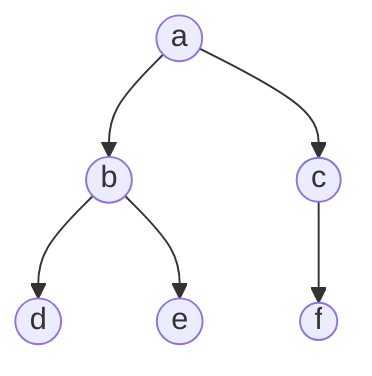

# Tree Breadth-First Traversal

## Example

Consider the simple binary tree below



The result of the Breadth-First Traversal will be as follows

```c++
output = a, b, c, d, e, f
```

> [!NOTE]+
> No recursive approach due to its reliance on a queue system

## Algorithm

### Initial

Initialize a queue and place the root.

### Iteration

While the queue is not empty:
 1. Pop the queue and display, check, or store the popped node's value
 2. Add the children of the popped node from leftmost to rightmost (if any)

### Worst Case Complexities

**Time :** $O(n)$
**Space :** $O(n)$
