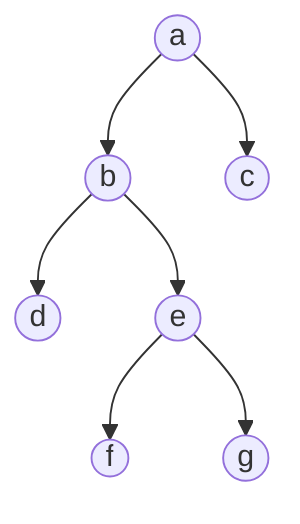
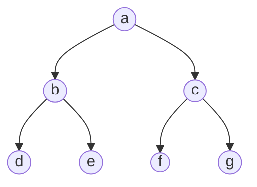
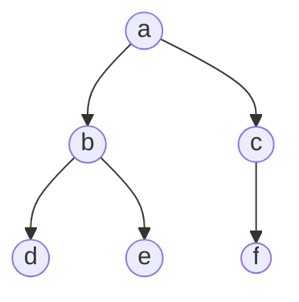
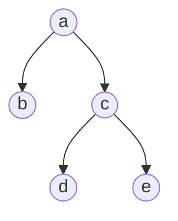
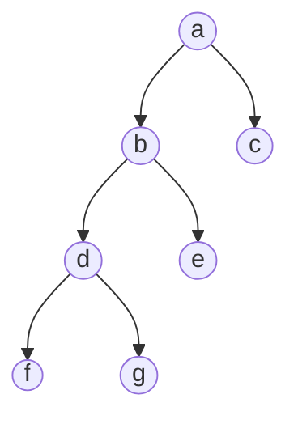

# Binary Tree Classifications

## Full Binary Tree

Every parent node has either two or no children

## Perfect Binary Tree

Every internal node has two children and every leaf node are at the same level. Consequently, perfect binary trees are full binary trees as well.

## Complete Binary Tree

A complete binary tree must all of its level be filled except for the last one where it only needs to be far left as possible.

## Degenerate or Pathological Binary Tree

Each level only has a single child, either left or right. A special case of this is a skewed binary tree where all children are only from the left or only from the right.

## Balanced Binary Tree

A binary tree is balanced if the difference of level between the subtree of the left node from the subtree of the right node is not more than 1.

### Examples

#### Balanced

Level of left is 1 and level of right is 2. The difference is 1 and that's balanced.

#### Unbalanced

Level of left is 3 and the level of right is 1. The difference is more than 1, thus unbalanced.

