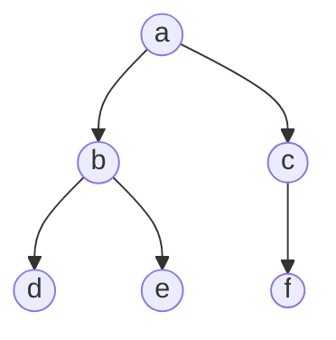

# Tree Pre-Order Traversal

## Example

Consider the simple binary tree below



The result of the Breadth-First Traversal will be as follows

```c++
output = a, b, d, e, c, f
```

## Iterative Algorithm

### Initial

Initialize a stack and place the root

### Iteration

While the stack is not empty:
 1. Pop the stack and display, check, or store the popped node's value
 2. Add the children of the popped node from rightmost to leftmost (if any)

### Worst Case Complexities

**Time :** $O(nodes)$
**Space :** $O(nodes)$ from stack used

## Recursive Algorithm

### Base Case

1. If the current node is null, return or end the function

### Recursive Step

1. Display, check, or store the current node
2. Call the function recursively for the left node
3. Call the function recursively for the right node

### Worst Case Complexities

**Time :** $O(nodes)$
**Space :** $O(nodes)$ from the function stack
